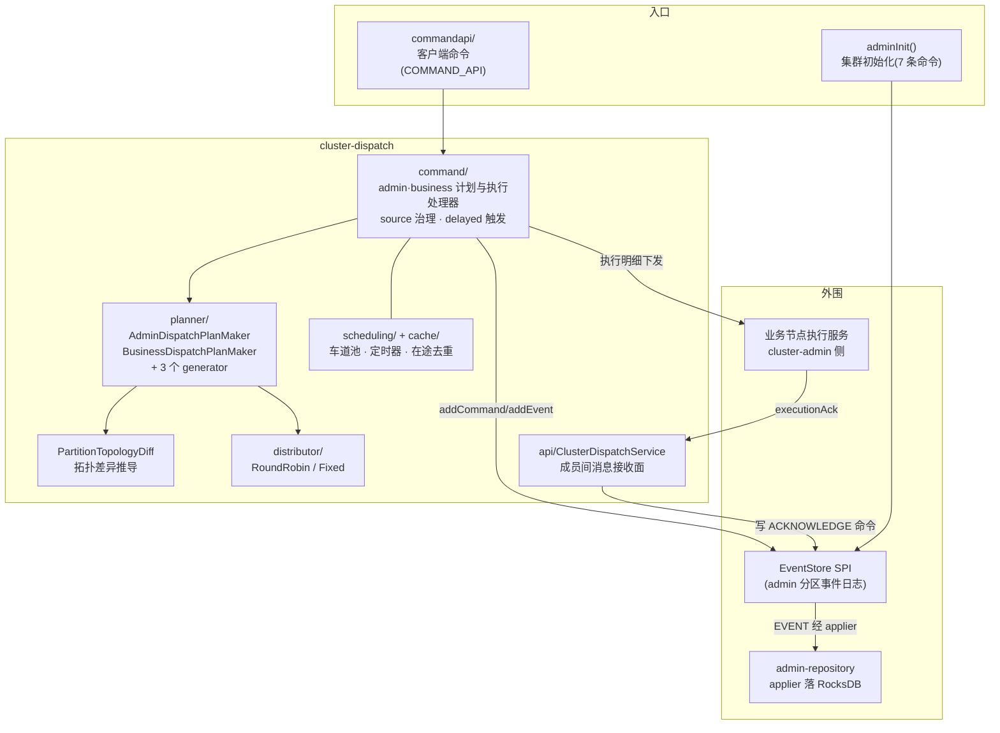

# 集群调度子系统技术设计

> 模块：`kunpeng/cluster/cluster-dispatch`（包 `com.anyilanxin.kunpeng.cluster.dispatch`，协作模块见 §6）。
> 本文描述集群调度的整体架构、统一生命周期与关键机制；逐环节细节见[详细设计](./02-cluster-dispatch-detail.md)。

---

## 1. 背景与目标

集群在运行过程中需要对成员与分区进行动态调整（副本增减、分区扩缩容、负载平衡等）。
所有调整以**调度命令**的形式发起，经管理 Raft 仲裁后生成**调度计划**，
再逐条下发执行明细并回流 ACK，保证同一时刻全局只推进一个调度动作。

核心约束：

1. **串行执行**：计划内执行明细按 `executionOrder` 依次下发，前一条 ACK 后才开始下一条；
   计划本身由 admin 分区日志单线程驱动。
2. **统一流程**：管理调度与业务调度走完全相同的生命周期链路（类型入口 → 计划制定 → 执行 → 完结），
   仅允许的调度类型不同。
3. **集中仲裁**：以管理 Raft Leader 为准，执行结果必须回 ACK 到 Leader 落日志。
4. **失败重试**：执行明细失败不终止计划——经延迟看门狗重新下发 EXECUTING 重试（见 §4.2）。

---

## 2. 总体架构



**分层职责**（均为 admin Leader 单线程流处理模型，COMMAND/COMMAND_API 记录驱动）：

| 层 | 位置 | 职责 |
|---|---|---|
| 命令入口 | `commandapi/` | 客户端 API 请求（建/取消/查询计划）经 COMMAND_API 记录进同一日志应答 |
| 计划层 | `command/{admin,business}/dispatch/` | 计划生命周期流转：类型入口、计划制定、执行启动、完结、失败、取消 |
| 执行层 | `command/{admin,business}/execution/` | 单条明细下发（含 ack 看门狗注册）与 ACK 成败判定推进 |
| 计划制定 | `planner/`（maker + generator） | 由当前拓扑与目标拓扑推导执行明细序列 |
| source 治理 | `command/source/` | source-id 分配与迁移台账（分区数据来源标识） |
| 延迟触发 | `command/delayed/` | 延迟任务（成员不足等待 + 执行重试看门狗）到期触发 |
| 消息接收 | `api/` | 成员间 ACK / node-source 消息解码并写回日志 |
| 基础设施 | `scheduling/`、`cache/`、`distributor/` | 车道池/定时器/在途命令去重、分区分布算法 |

---

## 3. 调度类型

调度以**类型化生命周期**驱动：调度类型的枚举值本身就是计划生命周期的入口命令，没有独立的 INITIALIZE 命令。

| 面 | 调度类型 | 含义 | 计划生成器 |
|---|---|---|---|
| 管理（admin） | `CHANGE_REPLICATION` | 管理分区组副本数调整 | `AdminDispatchPlanMaker` |
| 业务（business） | `CHANGE_PARTITION` | 业务分区数调整（全量初始化 = 该类型 + oldMeta 为空） | `ChangePartitionDispatchPlanGenerator` |
| 业务 | `CHANGE_REPLICATION` | 业务分区副本数调整（无数据迁移） | `ChangeReplicationDispatchPlanGenerator` |
| 业务 | `CLUSTER_BALANCE` | 全量分区重分布（round-robin） | `ClusterBalanceDispatchPlanGenerator` |

---

## 4. 统一计划生命周期与关键机制

### 4.1 生命周期链路

```mermaid
flowchart LR
    T["类型入口命令<br/>CHANGE_REPLICATION /<br/>CHANGE_PARTITION / CLUSTER_BALANCE"] --> PC["PLAN_CREATING"]
    PC -->|"成员不足"| PD["PLAN_DELAYED<br/>(延迟等待)"] -->|"到期重入"| PC
    PC -->|"计划制定完成"| PR["PLAN_CREATED"] --> EX["EXECUTING<br/>(计划级, 启动首条明细)"]
    EX --> ED["EXECUTED"] --> XE["明细串行:<br/>EXECUTING→EXECUTED→ACKNOWLEDGE<br/>→SUCCEED/FAILED"]
    XE -->|"全部完成"| CP["COMPLETING"] --> CD["COMPLETED<br/>+ 集群元数据落库"]
    XE -.->|"失败重试(不终止)" .-> XE
    T2["CANCELING"] --> CZ["CANCELED"]
    FL["FAILING"] --> FD["FAILED"]
```

- admin 与 business 两套同构生命周期（`AdminDispatchPlanLifeCycle` / `BusinessDispatchPlanLifeCycle`），
  business 侧多出 `CHANGE_PARTITION`/`CLUSTER_BALANCE` 两个类型入口。
- 执行明细生命周期（两套同构）：`EXECUTING → EXECUTED → ACKNOWLEDGE → SUCCEED/FAILED`，
  `ACKNOWLEDGE_TIMED_OUT` 保留位现由延迟看门狗机制承担。

### 4.2 计划制定（拓扑 diff 推导）

各生成器只负责计算**目标拓扑**，操作序列由 `PartitionTopologyDiff.diff(当前拓扑, 目标拓扑)` 统一推导
（分区新增 → 主成员 BOOTSTRAP + 其余成员 JOIN；副本增减 → JOIN/LEAVE；分区删除 → 全员 LEAVE 先行；
输出按分区 ID、成员 ID 升序保证确定性），再翻译为执行明细。缩容场景由生成器做多阶段编排
（leave → 数据合并 → STOP → 来源转移）。详见详细设计 §4。

### 4.3 延迟与看门狗重试

`DelayedRecord`（DelayedType = ADMIN_PLAN / ADMIN_EXECUTION / BUSINESS_PLAN / BUSINESS_EXECUTION）
+ `DelayedDelayChecker` 到期触发 + `DelayedTriggerProcessor` 四分支处理：

- **计划级**：成员不足时 PLAN_DELAYED，到期重发 `PLAN_CREATING`（单槽校验防过期计划复活）；
- **明细级**：每次下发注册 ack 看门狗，到期未达终态则重发 `EXECUTING` 重试；明细失败 ACK 同样注册延迟重试。

### 4.4 ACK 回流

业务节点执行完成后经 `dispatchClient.ack()` 发往 admin Leader；`ClusterDispatchService`
（topic `CLUSTER_DISPATCH_ACK`）解码 `PartitionExecutionAckRecord`，从仓库查回明细，
把成败与 errorMessage 附着后写 `ACKNOWLEDGE` 命令，由执行层 Acknowledge 处理器判定推进。

### 4.5 source 治理

分区数据来源标识（source-id）的分配与迁移台账：`NodeSource`（节点级 source 分配）与
`PartitionSource`（分区级来源转移 APPLYING/TRANSFERRING_ADD/...）两组命令族，
被计划制定（bootstrap 来源重写）与执行（LEAVE_SOURCE_TRANSFER）消费。详见详细设计 §7。

---

## 5. 集群初始化

admin 分区 Leader 就绪后 `DispatchProcessService.adminInit()` 一次性追加 7 条初始命令
（守卫为 `!isInitiator()`）：node-source 台账 ×2、partition-source 台账 ×2、
`AdminClusterMeta CREATING`、admin 计划 `CHANGE_REPLICATION`（initialize）与
business 计划 `CHANGE_PARTITION`（initialize + applyPlan，期望分区数取自节点配置）。
业务计划随类型入口走正常生命周期，最终完成业务分区全量创建与元数据落库。

---

## 6. 协作模块

| 模块 | 职责 |
|---|---|
| `kunpeng/cluster/cluster-admin` | Leader 转换接线（DispatchProcessServiceTransitionStep）、业务节点执行服务（BOOTSTRAP/JOIN/LEAVE 等执行消息接收） |
| `kunpeng/broker/broker-admin-client` | `DefaultClusterDispatchClient`：执行消息下发（topic = `PartitionType-ExecutionType`）与 ack，均带 5 次×2s 退避重试 |
| `kunpeng/protocol/protocol-admin(-impl)` | 记录与生命周期枚举定义（事实源） |
| `kunpeng/repository/admin-repository` | EVENT 经 applier 落 RocksDB（计划/明细/source/delayed/clustermeta 全套已实现） |

---

## 7. 风险与待决策

| # | 事项 | 现状 |
|---|------|------|
| 1 | adminInit 无数据库级幂等守卫 | Leader 重选举/重启会重复追加初始命令（仅 `!isInitiator()` 角色守卫） |
| 2 | AcknowledgeTimeOut 处理器空壳 | 超时职责已由延迟看门狗承担，空壳挂点是否删除待决策 |
| 3 | admin 计划单槽存储 | repository 中 admin 计划单槽（business 按 planId），同时只能有一个 admin 计划 |
| 4 | 明细失败重试无上限 | 失败 ACK 后再注册延迟重试，连续失败场景的重试上限/熔断策略未定 |

详细风险清单见[详细设计 §12](./02-cluster-dispatch-detail.md)。
