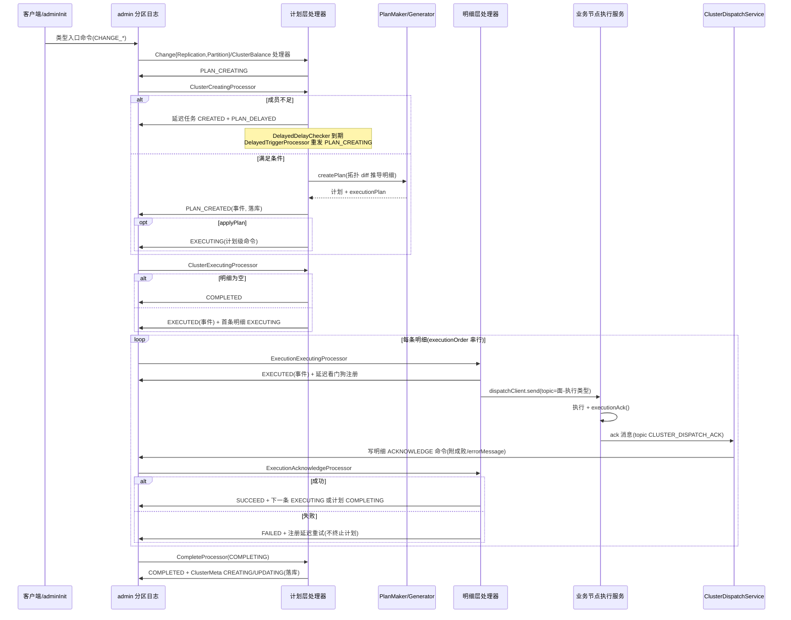
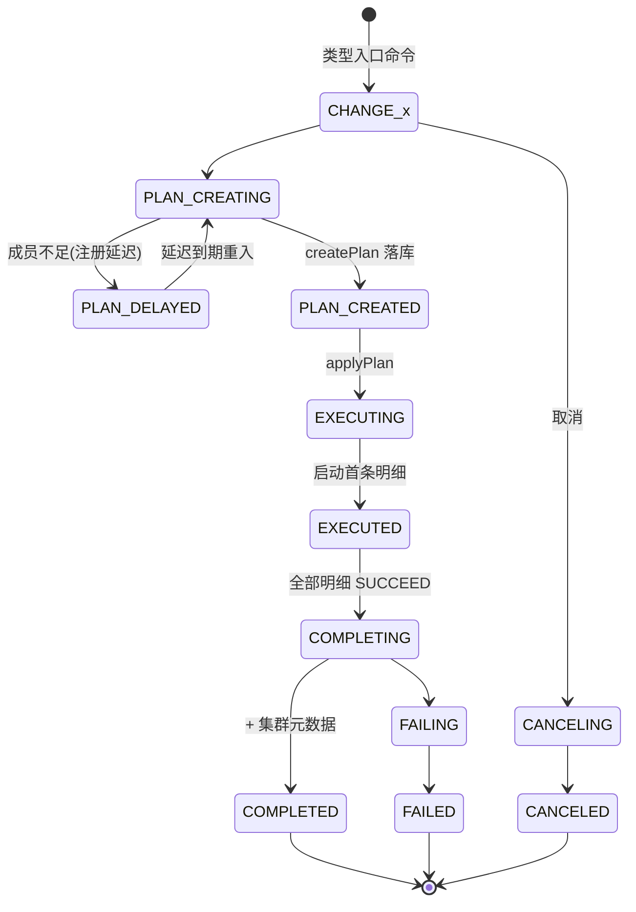

# 集群调度详细设计

> 模块：`kunpeng/cluster/cluster-dispatch`（包 `com.anyilanxin.kunpeng.cluster.dispatch`）。
> 上游设计：[01-cluster-dispatch-design.md](./01-cluster-dispatch-design.md)（整体架构与关键机制概览）。
> 本文按当前实现描述每一环节的处理器、状态机与代码点位。
>
> 历史说明：一期实施时的设计曾以 INITIALIZE 命令驱动，现已重构为类型化生命周期直驱，
> 本文即重构后的现状。

---

## 1. 文档说明

### 1.1 术语

| 术语 | 含义 |
|---|---|
| 调度计划（Plan） | 一次调度事件的顶层实体，`AdminDispatchPlanRecord` / `BusinessDispatchPlanRecord`，含依次执行的明细列表 |
| 执行明细（Execution） | 计划拆分后的单条调度动作（操作级：一条 BOOTSTRAP/JOIN/LEAVE/... 对一个成员），`AdminDispatchPlanExecutionRecord` / `BusinessDispatchPlanExecutionRecord` |
| 管理分区（admin partition） | 集群管理面 Raft 分区，调度命令的唯一仲裁点，调度流处理服务仅在其 Leader 上运行 |
| 业务分区 | 承载数据的业务面 Raft 分区组，调度动作的实际作用对象 |
| 拓扑（topology） | `PartitionInfoMetaRecord` 列表（每分区一条：分组、ID、成员、优先级、主成员） |
| source-id | 分区数据来源标识（节点级 `NodeSource` / 分区级 `PartitionSource` 台账） |

### 1.2 命令/事件模型

全部状态流转由 admin 分区日志驱动：处理器（processor）消费 COMMAND（或 COMMAND_API）并写新
COMMAND/EVENT；EVENT 经 admin-repository 的 applier `applyState` 落 RocksDB（当前 dispatch 相关
applier 全部已实现）。写入门面 `LogEventWriter`：`addCommand`（仅日志，待处理器消费）、
`addEvent`（日志 + 同步落库）、`nextKey()`/`millis()`。

计划生命周期枚举的 `isState()` 区分命令（false，驱动流转）与状态（true，落库可查）。

---

## 2. 包结构索引

模块根：`kunpeng/cluster/cluster-dispatch/src/main/java/com/anyilanxin/kunpeng/cluster/dispatch/`

| 包 | 内容 |
|---|---|
| （根） | `DispatchProcessService`（流处理服务/初始化）、`LogEventWriter`、处理器基础设施 |
| `commandapi/` | 客户端命令入口（COMMAND_API 记录 → 计划命令/查询应答） |
| `command/admin/dispatch/` | admin 计划层处理器 + `planner/AdminDispatchPlanMaker` |
| `command/admin/execution/` | admin 明细层处理器 + `AbstractAdminDispatchExecutionProcessor`（看门狗注册） |
| `command/business/dispatch/` | business 计划层处理器 + `planner/`（maker、3 个 generator、`PartitionTopologyDiff`、`ExecutionRecordFactory`） |
| `command/business/execution/` | business 明细层处理器（含 bootstrap 来源重写、LEAVE_SOURCE_TRANSFER 联动） |
| `command/source/` | source 治理处理器（NodeSource / PartitionSource / 两套 SourceMeta） |
| `command/delayed/` | `DelayedDelayChecker` + 延迟触发处理器 |
| `command/{admin,business}/clustermeta/` | 集群元数据落库处理器 |
| `api/` | `ClusterDispatchService`（成员间消息接收面） |
| `distributor/` | `PartitionDistributor` 接口 + `RoundRobinPartitionDistributor` / `FixedPartitionDistributor` |
| `scheduling/` | `TimerSchedulerFactory`/`OrderedTimerScheduler`/`AsyncTimerRouter`、`LanePool`/`ExecutionLane`、`BufferedCommandCollector`/`HeapCommandBatch`/`PendingCommandRegistry` |
| `cache/` | `BoundedPendingCommandRegistry`（在途命令去重）、`RegistryMetrics` |
| `eventlog/` | 日志读写抽象（`AdminLogRecord` 等） |

---

## 3. 端到端流程

---

## 4. 计划制定（planner）

### 4.1 策略结构

- **admin**：`AdminDispatchPlanMaker` 仅支持 `AdminDispatchType.CHANGE_REPLICATION`（单分区组扩/缩副本），
  经 `PartitionTopologyDiff` 推导 JOIN/LEAVE 明细（admin 面不产生 BOOTSTRAP 操作）。
- **business**：`BusinessDispatchPlanMaker` 为策略上下文（EnumMap 注册 3 个 generator），
  按计划类型分发到对应生成器。

### 4.2 PartitionTopologyDiff：拓扑差异统一推导

各调度策略只负责计算**目标拓扑**，操作序列由 `PartitionTopologyDiff.diff(current, target)` 统一翻译：

| 差异 | 推导操作 |
|---|---|
| 分区新增（目标有、当前无） | 主成员 `BOOTSTRAP`，其余成员按 ID 升序 `JOIN`（先引导后补副本） |
| 副本增加（分区两侧都有，目标更多） | 目标独有成员按 ID 升序 `JOIN` |
| 副本减少（当前更多） | 当前独有成员按 ID 升序 `LEAVE` |
| 分区删除（当前有、目标无） | 全部剩余成员按 ID 升序 `LEAVE`，整体先于其他操作输出 |
| 两侧一致 | 空操作（调用方得到空计划） |

输出确定性：按分区 ID 升序处理目标分区，已有分区先 JOIN 后 LEAVE（先扩后缩），成员操作按成员 ID 升序。

### 4.3 business 生成器

| 生成器 | 语义 |
|---|---|
| `ChangePartitionDispatchPlanGenerator` | 调整分区数。全量初始化（oldMeta 为空）：round-robin 分布全部期望分区，BOOTSTRAP 不带快照；扩容：新增分区 BOOTSTRAP 带快照引导（`bootstrapSnapshot=true`，从既有分区引导数据）；缩容：多阶段编排——被缩分区非 Leader 成员 LEAVE（收敛为单副本）→ 数据合并至保留分区（`DATA_MERGE`）→ Leader `STOP` 销毁 → 来源标识转移（`SOURCE_TRANSFER`）；保留分区全程完整副本，合并后 follower 镜像安装由 raft 侧完成 |
| `ChangeReplicationDispatchPlanGenerator` | 调整副本数，仅 JOIN/LEAVE，无数据迁移 |
| `ClusterBalanceDispatchPlanGenerator` | round-robin 全量重分布，按 diff 生成操作序列 |

### 4.4 明细组装（AbstractDispatchPlanGenerator）

- `newPlan`：沿用计划 ID，`applyPlan=true`；目标拓扑写入计划 `meta` 作为终态；
- `addExecution`：`executionOrder` 自动编排（当前列表 size），`planData` = 序列化负载
  （`ExecutionRecordFactory.bootstrap/join/leave/stop/dataMerge/sourceTransfer` 工厂），
  `partitionType=BUSINESS`，执行类型/执行成员取自负载；
- `appendDiff`：diff 操作 → 明细负载逐条追加，`bootstrapSnapshot` 透传给引导负载
  （当前拓扑为空即全量初始化时 false，否则 true）；
- `distribute`：`RoundRobinPartitionDistributor` 将分区分配到成员池（排序后确定性输出）。

### 4.5 计划制定入口处理器

`Admin/BusinessDispatchClusterCreatingProcessor`（消费 `PLAN_CREATING`）：

1. 期望规模 > 成员池 size（`ClusterMembershipService.getMemberIds(BROKER)`）→ 注册计划级延迟任务
   （`DelayedType.ADMIN_PLAN/BUSINESS_PLAN`，dueDate = now + `AdminConstant.DISPATCH_PLAN_TIME`）+
   `PLAN_DELAYED` 事件，等待成员加入后由延迟触发重入 PLAN_CREATING；
2. 满足条件 → `createPlan` 生成计划与明细 → `PLAN_CREATED` 事件（落库）；
   `applyPlan=true` 时追加计划级 `EXECUTING` 命令。

---

## 5. 执行明细链路

### 5.1 计划级 EXECUTING（启动执行）

`Admin/BusinessDispatchClusterExecutingProcessor`（消费计划 `EXECUTING`）：
明细为空直接 `COMPLETED`；否则发计划 `EXECUTED` 事件 + 首条明细 `EXECUTING` 命令。
business 版额外做 **bootstrap 来源重写**（`handleBootstrapExecutionSource`）：BOOTSTRAP 明细回填
sourceId、从捐赠分区迁移代理资源，并追加 `BOOTSTRAP_SOURCE_DATA_TRANSFER`/`BOOTSTRAP_SOURCE_TRANSFER`
明细后重编 executionOrder。

### 5.2 明细级 EXECUTING（下发 + 看门狗）

`Admin/BusinessDispatchExecutionExecutingProcessor`（消费明细 `EXECUTING`，admin/business 同构）：

1. 发明细 `EXECUTED` 事件（落库）；
2. `scheduleExecutionRetry` 注册 ack 看门狗：`DelayedType.{面}_EXECUTION` 延迟任务，
   dueDate = now + `DISPATCH_PLAN_TIME`，`delayChecker.schedule(dueDate)`；
3. `dispatchClient.send(memberId, partitionType, executionType, planData 负载)`，异步火后不管
   （topic = `getTopic(PartitionType, PartitionExecutionType)`，如 `BUSINESS-BOOTSTRAP`）。

### 5.3 ACK 回流与消费

- 接收面：`ClusterDispatchService`（`api/`）注册 `CLUSTER_DISPATCH_TOPIC_ACK`（= `CLUSTER_DISPATCH_ACK`）
  与 `CLUSTER_NODE_SOURCE_TOPIC`（= `CLUSTER_NODE_SOURCE`）两个 messaging handler；
  `handleDispatchAck` 解码 `PartitionExecutionAckRecord` → 从仓库查回明细 →
  SUCCEED/FAILED 与 errorMessage 附着在明细值上 → 写明细 `ACKNOWLEDGE` 命令。
- 消费侧 `ExecutionAcknowledgeProcessor`（admin/business 同构）：
  - **幂等守卫**：明细不存在或已达终态（SUCCEED/FAILED）直接跳过；
  - **FAILED**：明细置 FAILED（记录失败信息）后**再注册延迟重试**（重发 EXECUTING），不终止计划；
  - **SUCCEED**：明细置 SUCCEED + `dispatchEndTime`；有下一条 WAIT 明细 → 写下一条 `EXECUTING`，
    否则写计划 `COMPLETING`；
  - business 版额外处理 `LEAVE_SOURCE_TRANSFER` 明细 → 发 `PartitionSourceLifeCycle.TRANSFERRING_ADD`
    命令联动 source 台账。
- `ExecutionAcknowledgeTimeOutProcessor`（admin/business）当前为空壳挂点；超时重试职责已由
  延迟看门狗机制承担（见 §6）。

### 5.4 业务节点执行侧（cluster-admin 模块）

执行消息接收（`PartitionExecutionType` 共 11 值：BOOTSTRAP、BOOTSTRAP_SOURCE_DATA_TRANSFER、
BOOTSTRAP_SOURCE_TRANSFER、JOIN、LEAVE、LEAVE_SOURCE_DATA_TRANSFER、LEAVE_SOURCE_TRANSFER、
STOP、CONFIG_CHANGE、SOURCE_DATA_TRANSFER、SOURCE_TRANSFER）；本地 `addDispatch` 持久化在途调度
（重启后 `restartExecution()` 重放），执行完成 `dispatchComplete` 后 `executionAck()` 回执。

---

## 6. 延迟与看门狗（command/delayed/）

`DelayedRecord` 字段：`delayedId / partitionType / dueDate / delayedType / dispatchPlanId / dispatchPlanExecutionId`。

| DelayedType | 注册时机 | 到期动作（DelayedTriggerProcessor） |
|---|---|---|
| ADMIN_PLAN / BUSINESS_PLAN | 计划制定遇成员不足（PLAN_DELAYED） | 重发计划 `PLAN_CREATING`；admin 侧单槽校验（计划不存在或 ID 不匹配 → 过期跳过） |
| ADMIN_EXECUTION / BUSINESS_EXECUTION | 明细下发（ack 看门狗）/ 失败 ACK（重试） | 查明细：不存在 → 跳过；已终态（SUCCEED/FAILED）→ 淘汰过期看门狗；否则重发明细 `EXECUTING` |

- 触发链：`DelayedDelayChecker` 到期 → 写 `DelayedLifeCycle.TRIGGER` 命令 → 处理后 `TRIGGERED` 事件；
- 看门狗注册于 `AbstractAdminDispatchExecutionProcessor.scheduleExecutionRetry`（business 同构基类），
  期限 `AdminConstant.DISPATCH_PLAN_TIME`。

---

## 7. source 治理（command/source/）

分区数据来源标识的分配与迁移台账，被计划制定与执行消费：

| 处理器 | 消费 | 行为 |
|---|---|---|
| `NodeSourceApplyingProcessor` | `APPLYING` | 分配 sourceId = maxNodeSourceId+1，发 `UPDATED`（meta 台账）+ `APPLIED` |
| `PartitionSourceApplyingProcessor` | `APPLYING` | 幂等（已有 source 跳过） |
| `PartitionSourceTransferringProcessor` | `TRANSFERRING_ADD` | 来源转移 → `TRANSFERRED_ADD` |
| 两套 SourceMeta Creating/Updating | `CREATING`/`UPDATING` | 台账落库事件 `CREATED`/`UPDATED` |

与调度的关联：

- 计划执行启动时 `BusinessDispatchClusterExecutingProcessor.nextTransfer/applyNewSource` 读取
  `repositorySource.getPartitionAgentSources()` 决定来源迁移或新申请；
- bootstrap 来源重写（§5.1）在计划制定后执行期回填 sourceId 并追加来源转移明细。

---

## 8. 集群初始化（adminInit）

`DispatchProcessService.startProcessing()`：注册日志监听 → `dispatchService.start` →
`processNextEvent` → 重振 checker（`SchedulerCheckerAware.onRecovered`）→ `adminInit()`。

`adminInit()`（守卫 `!adminConfiguration.isInitiator()`，仅非发起者节点补写；**无数据库级幂等守卫**）
一次性 `tryAppend` 7 条初始命令：

| # | 命令 | 负载要点 |
|---|---|---|
| 1 | `NodeSourceMetaLifeCycle.CREATING` | version=1，maxNodeSourceId=初始值 |
| 2 | `NodeSourceLifeCycle.APPLYING` | 本地成员 source 申请 |
| 3 | `PartitionSourceMetaLifeCycle.CREATING` | maxPartitionSourceId=初始值 |
| 4 | `PartitionSourceLifeCycle.APPLYING` | admin 分区（partitionId=1）来源登记 |
| 5 | `AdminClusterMetaLifeCycle.CREATING` | admin 分区拓扑快照，RF=1，version=1 |
| 6 | `AdminDispatchPlanLifeCycle.CHANGE_REPLICATION` | initialize=true，期望副本数取管理面配置 |
| 7 | `BusinessDispatchPlanLifeCycle.CHANGE_PARTITION` | initialize=true，applyPlan=true，期望分区数取节点配置 |

命令 6/7 即调度入口：随类型生命周期走正常链路（成员不足则延迟等待），最终完成
admin 副本扩展与业务分区全量创建（CHANGE_PARTITION + oldMeta 为空 = 全量初始化）。

---

## 9. 外围设施

### 9.1 commandapi（客户端命令入口）

外部 API 请求以 COMMAND_API 记录进同一日志（经 `CommandApiHandle`/`BatchProcessingCollect` 应答）：

- business 5 个：Balance / ChangePartition / ChangeReplication（校验后发对应类型入口命令）、
  Cancel（→ `CANCELING`）、Query（读仓库应答 `DISPATCH_QUERY_RESPONSE`）；
- admin 3 个：ChangeReplication / ChangeCancel / Query。

与 `api/ClusterDispatchService` 无直接关系：前者是客户端命令入口，后者是成员间消息接收面。

### 9.2 dispatchClient（broker-admin-client）

`DefaultClusterDispatchClient`：执行消息 topic = `PartitionType-ExecutionType`
（`PartitionExecutionType.getTopic`），node-source 用 `NODE-SOURCE`；ack 与下发均带 5 次×2s 退避重试。

### 9.3 distributor

`PartitionDistributor`（输入成员池 + 排序分区 + 副本数，输出布局）：`RoundRobinPartitionDistributor`
（生成器 `distribute` 使用）与 `FixedPartitionDistributor`（静态映射），由
`StaticConfigurationGenerator.getPartitionDistributor` 选择。

### 9.4 scheduling 与 cache

- 定时/车道基础设施：`TimerSchedulerFactory`/`OrderedTimerScheduler`/`AsyncTimerRouter`（任务经车道
  actor 异步执行）+ `LanePool`/`ExecutionLane`（失败自愈 + 健康回调）；
- `BufferedCommandCollector` + `HeapCommandBatch` + `PendingCommandRegistry`：在途命令按
  lifeCycle+key 去重短路、Staging 会话提交；
- `cache/BoundedPendingCommandRegistry.forIntents`：仅对 `DelayedLifeCycle.TRIGGER` 在途去重，
  容量 100_000；`RegistryMetrics` 按 lifeCycle 上报 gauge；
- 延迟看门狗到期检查与初始化恢复（`onRecovered`）均跑在该基础设施上。

---

## 10. 状态机（含枚举数值）

### 10.1 计划生命周期

admin（`AdminDispatchPlanLifeCycle`，recordIndex=0）：

| 值 | 枚举 | 命令/状态 |
|---|---|---|
| 1 | CHANGE_REPLICATION | 命令（类型入口） |
| 2 | PLAN_DELAYED | 状态（成员不足延迟中） |
| 3 | PLAN_CREATING | 命令 |
| 4 | PLAN_CREATED | 状态（计划与明细已落库） |
| 5/6 | CANCELING / CANCELED | 命令 / 状态 |
| 7/8 | EXECUTING / EXECUTED | 命令（计划级启动）/ 状态 |
| 9/10 | COMPLETING / COMPLETED | 命令 / 状态（终态） |
| 11/12 | FAILING / FAILED | 命令 / 状态（终态） |

business（`BusinessDispatchPlanLifeCycle`，recordIndex=3）同构，多两个类型入口：
CHANGE_PARTITION=1、CLUSTER_BALANCE=2、CHANGE_REPLICATION=3，PLAN_DELAYED=4 … FAILED=14。

### 10.2 执行明细生命周期（admin/business 同构）

| 值 | 枚举 | 命令/状态 |
|---|---|---|
| 1 | EXECUTING | 命令（下发） |
| 2 | EXECUTED | 状态（已发送/已接收） |
| 3 | ACKNOWLEDGE | 命令（ack 回流落日志） |
| 4 | ACKNOWLEDGE_TIMED_OUT | 保留位（职责已由延迟看门狗承担） |
| 5/6 | SUCCEED / FAILED | 状态（终态，事件落库） |

明细记录另有独立状态字段 `DispatchExecutionState`：`WAIT / EXECUTED / SUCCEED / FAILED`
（与生命周期枚举两套，repository 查询与看门狗终态判定使用）。

### 10.3 延迟与 source 生命周期

- `DelayedLifeCycle`（recordIndex=22）：CREATED=1 / TRIGGER=2 / TRIGGERED=3 / CANCELED=4；
- `NodeSourceLifeCycle`（recordIndex=23）：APPLYING=1 / APPLIED=2；
- `PartitionSourceLifeCycle`（recordIndex=25）：APPLYING=1 / APPLIED=2 / TRANSFERRING_ADD=3 /
  TRANSFERRED_ADD=4 / TRANSFERRED_REMOVE=5；
- 两套 SourceMeta LifeCycle：CREATING/CREATED/UPDATING/UPDATED。

---

## 11. 代码点位索引

| 组件 | 位置（相对模块根包） | 说明 |
|---|---|---|
| 流处理服务 | `DispatchProcessService`（adminInit/startProcessing/processNextEvent） | 日志消费驱动、事务、初始化 |
| Leader 接线 | cluster-admin `transition/dispatch/DispatchProcessServiceTransitionStep` | onLeader 启动 / onFollower 关闭 |
| admin 计划处理器 | `command/admin/dispatch/processor/AdminDispatch{ChangeReplication,ClusterCreating,ClusterExecuting,Complete,Fail,ClusterCancel}Processor` | 6 个，注册于 `AdminDispatchProcessorRegister` |
| admin 明细处理器 | `command/admin/execution/processor/AdminDispatchExecution{Executing,Acknowledge,AcknowledgeTimeOut}Processor` | 基类含看门狗注册；TimeOut 空壳 |
| business 计划处理器 | `command/business/dispatch/processor/BusinessDispatch{ChangePartition,ChangeReplication,ClusterBalance,ClusterPlanCreating,ClusterExecuting,Complete,ClusterCancel,Fail}Processor` | 8 个，注册于 `BusinessDispatchProcessorRegister` |
| business 明细处理器 | `command/business/execution/processor/BusinessDispatchExecution{Executing,Acknowledge,AcknowledgeTimeOut}Processor` | Executing 含 bootstrap 来源重写 |
| 计划制定 | `command/{admin,business}/dispatch/planner/` | maker + generator + `PartitionTopologyDiff` + `ExecutionRecordFactory` |
| 延迟触发 | `command/delayed/processor/DelayedTriggerProcessor` + `DelayedDelayChecker` | 四分支重入/重试 |
| source 治理 | `command/source/processor/` | NodeSource / PartitionSource / 两套 Meta |
| ACK 接收面 | `api/ClusterDispatchService` | topic 常量 `CLUSTER_DISPATCH_ACK` / `CLUSTER_NODE_SOURCE`（protocol-common `ClusterCommonConstant`） |
| 下发客户端 | broker-admin-client `DefaultClusterDispatchClient` | topic 规则 + 5×2s 重试 |
| 客户端入口 | `commandapi/` | business 5 / admin 3 处理器 |
| 记录与枚举 | protocol-admin `record/command/`、protocol-admin-impl `record/command/` | 生命周期/类型/记录定义（事实源） |
| 落库 applier | admin-repository `modules/{admin,business}/applier/impl/` | dispatch 计划/明细/source/delayed/clustermeta 全套已实现 |

处理器三层职责（admin/business 同构）：`dispatch/`（计划层）、`execution/`（明细层）、
`clustermeta/`（元数据层：计划完结后集群元数据落库，CompleteProcessor 按 initialize 选
CREATING/UPDATING）。

---

## 12. 已知风险与边界

| # | 事项 | 说明 | 处理建议 |
|---|------|------|----------|
| 1 | adminInit 无幂等守卫 | 仅 `!isInitiator()` 角色守卫；Leader 重选举/重启会重复追加 7 条初始命令 | 以 clusterMeta 存在性或 haveDispatch 标志做守卫 |
| 2 | AcknowledgeTimeOut 空壳 | 超时职责已由延迟看门狗承担，枚举 ACKNOWLEDGE_TIMED_OUT 与处理器保留 | 决策：删除挂点或保留扩展位 |
| 3 | admin 计划单槽存储 | repository admin 计划单槽（`getDispatchPlan()` 无参），同时只能有一个 admin 计划；business 按 planId 多槽 | 如需并发 admin 计划需扩展存储 |
| 4 | 明细失败重试无上限 | 失败 ACK 后再注册延迟重试，连续失败（如成员长期不可达）会持续循环 | 增加重试计数/熔断，超限转计划 FAILING |
| 5 | processBusinessPlan 无空指针守卫 | `DelayedTriggerProcessor.processBusinessPlan` 查回计划未判 null 即写命令 | 补 null 守卫（与 admin 分支对齐） |
| 6 | 下发为异步火后不管 | send 失败仅记日志，兜底依赖看门狗重试 | 现状可接受；监控看门狗触发频率 |
| 7 | DispatchExecutionState 与生命周期两套状态 | 明细记录状态字段与生命周期枚举并存（WAIT/EXECUTED/SUCCEED/FAILED vs EXECUTING/...） | 保持文档显式区分，避免混用 |
