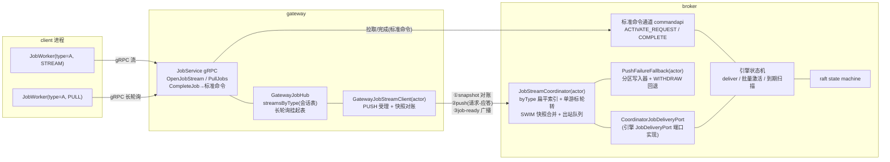
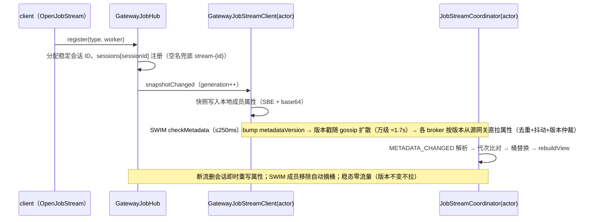
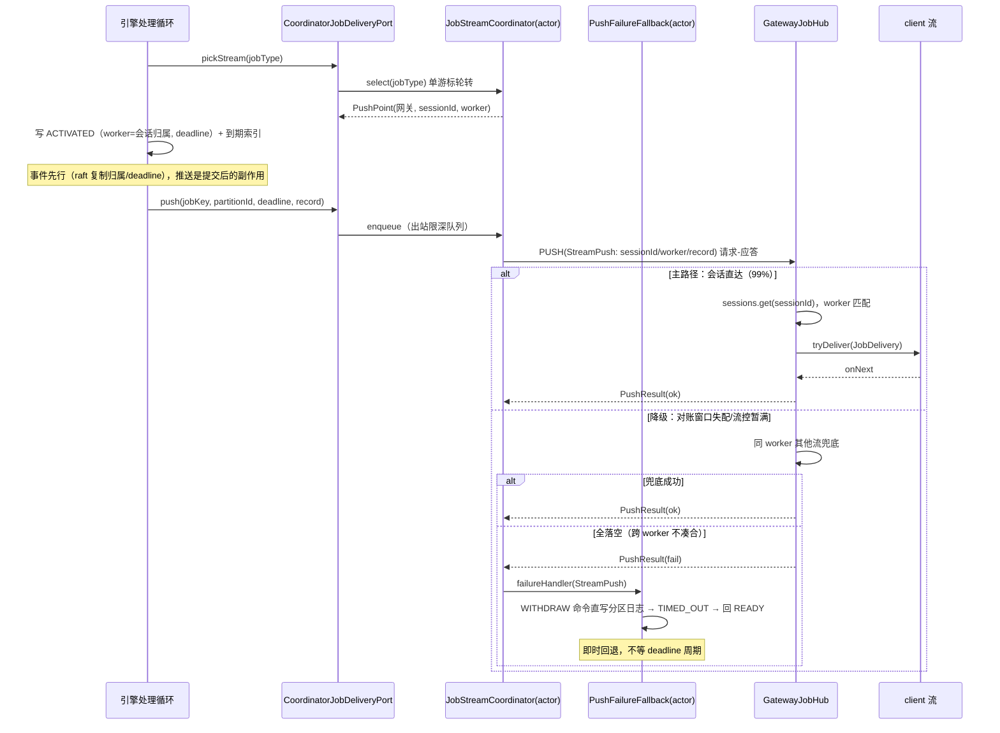
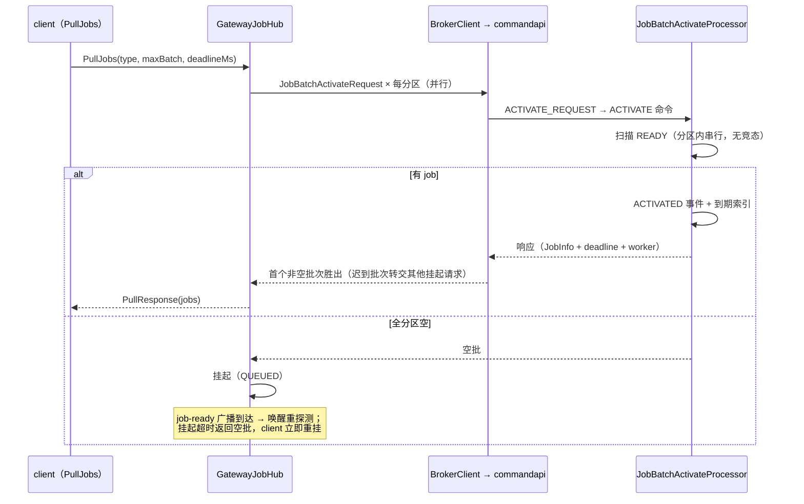
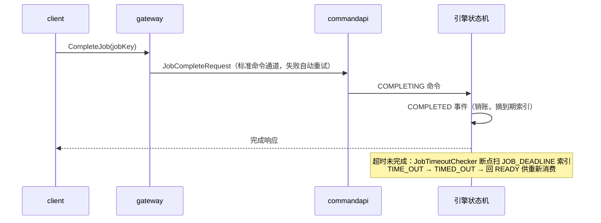

# 分布式 Job 推拉系统设计（Gateway ↔ Broker 消息系统）

> 范围：job 的实时流推送（push）与长连接拉取（long-polling pull）的完整链路设计。
> 前提：broker 为一套 raft group（共识/复制/leader 选举由 raft 保证，本文将其视为黑盒）；gateway 与 broker 之间复用本仓库 `cluster/` 消息框架（Netty 实现）。

---
## 1. 背景与目标

```
client ──gRPC──> gateway ──cluster/messaging──> broker(raft group)
```

- broker raft group 是 job 数据的**生产方**（job 提交并复制成功后成为待派发任务）。
- client 上运行多个 **JobWorker**（消费者），每个 worker 绑定一种 `jobType`。
- 消费模式有两种：
  - **STREAM（实时流推送）**：worker 持有到 gateway 的 gRPC 双向流，job 产生后主动推达；
  - **PULL（长连接拉取）**：worker 通过 gRPC long-polling 挂起拉取，被广播唤醒后立即返回。

**整体派发原则（一句话）**：**有可用聚合流 → 引擎写 ACTIVATED 事件（worker/deadline 随事件落账）后副作用推送；无聚合流 → 广播"xxx job type 可消费"，由 gateway 长轮询经标准命令通道取走。**

**多消费者语义**：同一 jobType 允许多个 client 消费——可能在同一 gateway，也可能跨 gateway；语义为**竞争消费**，一个 job 恰好派给其中一个 worker，不重复投递、不 fanout。

**消费归属**：投递前即确定 worker（轮转会话选定）并随 ACTIVATED 事件 raft 复制落 lockOwner——"记住谁消费的"是审计与排查的归属依据；重试本身不依赖 worker（回 READY 后任何消费者可再取）。

**设计目标**

| 指标 | 目标 |
|---|---|
| 实时流推送端到端延迟 | raft commit 后 P99 < 10ms（同机房） |
| 长轮询唤醒延迟 | ≈ push 延迟 + 1 RTT（挂起请求被通知后立即返回） |
| 派发吞吐 | 数百消费者/多 gateway 下，broker 订阅视图与推送扇出为 **O(jobType 数)**，与消费者数量解耦 |
| 可靠性边界 | 传输层 at-most-once：**deadline 落引擎事件溯源状态机**（raft 复制）；超时回 READY 自愈、推送失败 WITHDRAW 即时回退 |
| 可用性 | gateway、worker、broker leader 任意故障均可自愈（对账式订阅同步 + 快照重发幂等） |

**明确不做（业务侧职责）**：处理超时的具体动作、失败重试策略、幂等去重、死信——本系统只负责把 job 送达、把激活/超时状态迁移写进状态机。

---

## 2. 总体架构与角色



**job 链路仅 3 个专属 wire 触点，其余全部走标准命令通道**（与部署、启动流程同路）：

| 触点 | 方向 | 语义 |
|---|---|---|
| `job-stream-snapshot`（成员属性） | GW→B（SWIM 元数据通道） | 聚合订阅快照对账（generation 幂等）；替代注册/心跳/下线一族主题与一切注册报文，零 job 专属传输 |
| `job-stream-push` | B→GW（请求-应答 PushResult） | 单条流推送；**应答即送达确认**，失败在发送端就地可知 |
| `job-ready` | B→GW（ClusterEventService 广播，fire-and-forget、按主题订阅者定向扇出） | 无流时唤醒挂起的长轮询，载荷仅 jobType 字符串；可丢弃——唤醒幂等，漏发由长轮询超时兜底重探 |

| 角色 | 职责 |
|---|---|
| client / JobWorker | 执行 job；流或长轮询消费；**完成后直接调 CompleteJob/FailJob 命令 rpc**（无独立 resolve 通道） |
| gateway | 终结 client gRPC；维护会话表（快照事实源）与长轮询挂起表；推送按会话分发；拉取经 `BrokerClient` 标准命令通道全分区探测 |
| broker | `JobStreamCoordinator` 持订阅桶与 byType 扁平投影、单游标轮转选点、请求-应答推送；引擎侧 `deliver` 编排投递与事件落账 |
| 引擎状态机 | ACTIVATED 落激活态 + 到期索引；到期扫描 TIME_OUT 回 READY；推送失败 WITHDRAW 即时回退——全程 raft 复制 |

---

## 3. 核心抽象与数据模型

```java
// —— 订阅（稳定会话映射：每 (gateway, jobType) 一条聚合）——
record Aggregate(String jobType, List<Session> sessions) {}
record Session(long sessionId, String worker) {}
//   会话 ID 由网关分配（自增 long，稳定不复用）；流下线只删自身项——其他会话寻址不受影响
//   map.size() 即活跃流数（事实描述，非独立数据；背压落地时再显式化）

// —— 协调器选点（单游标轮转的产物，一次选定即绑定归属）——
record PushPoint(String gatewayMemberId, long sessionId, String worker) {}

// —— 单条推送载荷（完整 JobRecord 随行）——
record StreamPush(long sessionId, String worker, long jobKey,
                  int partitionId, long deadline, JobRecord record) {}

// —— 引擎侧端口（broker 层实现）——
interface JobDeliveryPort {
  void announceAvailable(String jobType);          // 广播唤醒长轮询
  Optional<DeliveryChannel> pickStream(String jobType);     // 单游标轮转选点
  interface JobStream {
    String worker();                                 // 选定归属（落 lockOwner）
    void push(long jobKey, int partitionId, long deadline, JobRecord record);
  }
}
```

**job 状态机**（引擎事件溯源，raft 复制）：

```
READY ──ACTIVATE──> ACTIVATED(lockOwner/dueDate + 写 (deadline,jobKey) 到期索引)
ACTIVATED ──COMPLETING──> COMPLETED（完成，销账）
ACTIVATED ──TIME_OUT(到期扫描)──> TIMED_OUT ──> READY（回待激活）
ACTIVATED ──WITHDRAW(推送失败回退)──> TIMED_OUT ──> READY（即时回退，不等 deadline）
```

---

## 4. 控制面：聚合订阅快照对账

**聚合注册（稳定会话映射）**：gateway 按 (gateway, jobType) 聚合上报——每类型一条 `Aggregate(jobType, sessions)`，sessions 为稳定会话 ID → worker 映射（`streamsByType` 每类型一个 `ConcurrentHashMap<sessionId, DeliveryStream>`）。会话 ID 由网关自增分配、永不复用；**流下线只删自身项**——broker 轮转与在途推送的寻址不受其他会话增删影响（对比数组模型：位置下标在删除时重排，在途寻址错位靠兜底压制）。

- **broker 视图与推送扇出 O(jobType 数)**：数百消费者（少方法 × 多实例）场景下同方法多实例在 map 里天然同名聚合，注册条数不涨。
- **generation 幂等**：快照代次单调递增，仅在流集变化时推进；broker 丢弃迟到旧代次（反熵重拉等乱序场景无害忽略）。
- **网关离线**：集群成员移除监听（SWIM）自动摘订阅桶，无需 bye 主题。
- **传输通道（SWIM 元数据通道搭车）**：网关把快照（SBE 帧 base64）写入本地成员属性 `job-stream-snapshot`，SWIM checkMetadata 检出变更（≤250ms）bump metadataVersion，版本戳随 gossip 扩散（250ms/轮，万级约 1.7s 全员可见）；各 broker 见版本落后经拉取通道从 owner（源网关，中转对端兜底）**直取**全量属性——版本号仲裁旧响应、去重+抖动防拉取风暴、周期元数据反熵兜底丢失通知。稳态零流量（版本不变不拉）；合并=比代次取新，网关源权威无冲突。
- **三种传输 ↔ 三种可靠性**：快照=SWIM 元数据通道（版本反熵 + owner 直拉，最终一致）；push=请求-应答（应答即送达确认，失败 WITHDRAW）；job-ready=fire-and-forget 广播（可丢弃的唤醒 hint——唤醒幂等、漏发由轮询超时兜底，这正是它能用不可靠广播的原因）。
- **会话数语义**：容量提示与观测信号（`map.size()` 纯派生），不承担投递正确性——会话视图短暂过期的代价最多一次 WITHDRAW 重派（§7）。

---

## 5. 数据面：流推送与长轮询

### 5.1 流推送（deliver 编排）

```
deliver(jobKey, jobRecord):
  point = coordinator.select(jobType)        # 单游标轮转：jobType → 跨网关合并的扁平会话列表
  if point.isEmpty:
    sideEffect: streamer.announceAvailable(jobType)   # 广播唤醒长轮询，job 留 READY
    return
  batch = JobBatchRecord{worker = point.worker,         # ← 消费归属：轮转会话的 worker
                         deadline, jobKeys=[jobKey]}
  addEvent(ACTIVATED, batch)                 # 事件先于推送（raft 复制 lockOwner/dueDate/到期索引）
  sideEffect: stream.push(jobKey, partitionId, deadline, jobRecord)
```

**推送分发：broker 定点、网关直达（主路径）**——选点由 broker 一手完成：jobType 直接索引到跨网关合并的扁平会话列表（`List<PushPoint>`），单游标取模轮转在选定会话的**同一时刻**取该会话 worker 落 lockOwner（每会话精确等份额——两级"先转网关再转会话"在网关间均分不随会话数加权，会向小网关系统性倾斜，扁平化一并消除）——归属必须随 ACTIVATED 事件 raft 复制，因此归属在 broker 定、不由网关挑流；网关只执行投递：`sessions.get(sessionId)` map O(1) 直达目标流，无遍历、无分发决策（会话 ID 稳定不复用，其他流上下线不影响在途寻址）。用轮转而非随机：高频下均匀性等价，但轮转是确定性摊开（不会运气差连续漏同一条流），实现即一个取模。

**对账窗口降级（三规则的后两条，非常规分发）**：快照是"变化即发 + 周期对账"，broker 的会话视图可能短暂过期——目标会话刚下线而快照在途、或目标流 gRPC 流控窗口暂满（`isReady=false`）。此时：②同 worker 兜底——会话查无/worker 失配/流忙时找**同 worker** 的其他流顶上（归属不变）；③跨 worker 不凑合——返回未送达 → broker WITHDRAW 重派，**绝不投给别的 worker 的流**（lockOwner 与实际处理者不能错位）。取舍说明：纯透传（失配一律 WITHDRAW）同样正确，代价是对账毛刺全部转化为重派；保留两级兜底以十几行代码换 WITHDRAW 率与重派延迟的显著下降。

**推送失败回退**：PUSH 请求-应答超时/未送达 → `PushFailureFallback`（持各分区 leader 期写入器）直写 `JobLifeCycle.WITHDRAW` 命令 → `TIMED_OUT` 事件 → 回 READY——job 立即可被其他流或长轮询取走，不必等满 deadline 周期。

### 5.2 长轮询（标准命令通道）

gateway 收到 PullJobs：立即向**全部分区**发 `JobBatchActivateRequest`（`BrokerClient.sendRequest`，与部署等所有命令同一条 commandapi 通道）；首个非空批次胜出响应 client，全空则挂起（PendingPull 三态 CAS：QUEUED/PROBING/DONE），被 `job-ready` 广播唤醒重试，挂起超时返回空批（client 立即重挂）。

- 扫描激活发生在 `JobBatchActivateProcessor`（分区内串行处理）——**无并发取批竞态**，无需任何在途保护。
- 迟到的非空批次（请求已超时）转交同类型其他挂起请求；无人可接则丢弃（分区侧到期扫描自愈）。

### 5.3 完成/失败（无独立通道）

client 直接调 `CompleteJob` / `FailJob` 命令 rpc → commandapi → `COMPLETING/COMPLETED` 事件落账，deadline 到期索引随销账摘除。**不存在 ResolveJob 专属通道，也不在流上复用销账信号。**


### 5.4 端到端交互时序

**① 订阅注册与对账**（变化即写属性，SWIM 版本反熵扩散）：



**② 流推送**（主路径 broker 定点、网关直达；降级与回退）：



**③ 长轮询**（标准命令通道全分区探测，空批挂起等广播唤醒）：



**④ 完成与超时回退**（完成走标准命令通道；到期由状态机自愈）：



---

## 6. 消费归属与 deadline 状态机

- **归属闭环**：引擎按 `workers[targetIndex]` 落 lockOwner（ACTIVATED 事件，raft 复制）→ 网关三规则分发保证实际处理者与 lockOwner 一致 → 完成事件销账。排查"谁消费了"直接查存储。
- **worker 名来源**（三层）：①client 注解 `@JobWorker(name=...)` 显式指定；②starter 空 name 时生成方法指纹 **`beanName#methodName`**（跨重启稳定，同方法多实例天然同名、合入同一会话聚合——对齐 Camunda 官方 `GeneratedFromMethodInfo` 规则）；③网关空名兜底 `stream-{streamId}`（防御裸 gRPC/非 Java client，lockOwner 永不为空）。
- **deadline**：`JobBatchActivateApiProcessor` 按 `now + request timeout` 落批事件（推送路径用 `lockExpireTime` 秒数或缺省 60s）；存储 applier 写 `(deadline, jobKey)` 复合键到 `JOB_DEADLINE` 列族；`JobTimeoutChecker` 断点扫描到期索引发 TIME_OUT 命令回 READY。
- **重试与 worker 的关系**：重试是 retries 计数 + 回 READY 重派（任何消费者可再取），**不依赖 worker**；lockOwner 是归属记录（审计/排查），不是重试依据。

---

## 7. 故障处理矩阵

| 故障 | 检测点 | 处置 | 语义 |
|---|---|---|---|
| job 到期未完成 | 引擎到期扫描（JOB_DEADLINE 索引） | TIME_OUT 命令 → TIMED_OUT 事件 → 回 READY | 超时自愈，可重新消费 |
| 流推送未送达 | PUSH 应答失败/超时（网关三规则全落空） | WITHDRAW 命令直写分区日志 → 即时回 READY | 不等 deadline，快速重派 |
| client 流断开 | 网关 onError/onCompleted | 摘会话（零重排）→ 快照重发；在途推送按应答失败 WITHDRAW | broker 会话视图随对账收敛 |
| 网关宕机 | SWIM 成员移除监听 | broker 摘订阅桶；在途推送应答超时 → WITHDRAW | 无需 bye 主题 |
| broker leader 切换 | raft 选举 | 订阅投影各 broker 等值（快照广播注册）；状态机随 raft 恢复 | 换主零空窗 |
| job-ready 广播丢失 | — | 长轮询挂起超时返回空批，client 立即重挂重探测 | 兜底无损 |
| 快照丢失/乱序 | broker generation 比对 | 周期对账重发自愈；旧代次忽略仍 ack | 幂等无害 |
| client 完成后 broker 未收到 | 命令通道重试（BrokerClient.sendRequestWithRetry） | CompleteJob 幂等重发 | 完成不丢 |

---

## 8. 协议设计

### 8.1 client ↔ gateway（gRPC，job_service.proto）

| rpc | 语义 |
|---|---|
| `OpenJobStream`（双向流） | 首请求携带 register(type, worker, capacity)；完成不经流，无需其他信号 |
| `PullJobs` | 长轮询：立即全分区探测，全空挂起，超时空批 |
| `CompleteJob` / `FailJob` / `UpdateJobRetries` / `UpdateJobTimeout` / `ThrowError` | 业务命令面（标准命令通道） |

### 8.2 gateway ↔ broker（cluster/messaging，SBE）

三触点（§2 表），编解码统一 **SBE**（`jobstream-schema.xml`，schema id=11，`kunpeng.sbe-java` 生成，与 gateway/inter-partition/raft-entry/sink 归一）：

| message | 字段 |
|---|---|
| `subscriptionSnapshot` | generation + 嵌套 group（aggregates × sessions{sessionId int64, worker varData}） |
| `streamPush` | sessionId + jobKey + partitionId + deadline + worker(varData) + record(**blob：structpack JobRecord 帧**) |
| `pushResult` | delivered + reason |

SBE 约束备注：group 内成员必须 field→group→data 顺序；groupSizeEncoding 的 numInGroup 用 uint16（默认 uint8 容纳不了数百消费者）；data 段必写（null 落 0 长度空段）。

---

## 9. 关键实现

**类清单**

| 层 | 类 | 职责 |
|---|---|---|
| broker-client | `jobstream.JobStreamCoordinator`（actor） | 订阅桶 + byType 扁平视图 + 单游标轮转 select + SWIM 快照合并 + 出站限深队列 + 请求-应答推送 |
| broker-client | `JobStreamMessages` / `JobStreamWireCodec` / `JobStreamSubjects` | 消息 record / SBE 适配 / 主题常量 |
| broker | `jobstream.CoordinatorJobDeliveryPort` | 引擎 `JobDeliveryPort` 端口实现（无状态，跨分区共享） |
| broker | `jobstream.PushFailureFallback`（actor） | 各分区 leader 期写入器登记；失败直写 WITHDRAW 命令 |
| broker | `bootstrap.step.jobstream.JobStreamBootstrapStep` | 构建 `JobStreamDispatcher(coordinator, streamer, fallbackHandler)` + 成员事件监听（MEMBER_REMOVED 摘桶 / METADATA_CHANGED 快照解析） |
| 引擎 | `bpmn.JobDeliveryPort` 端口 / `BpmnJobDeliveryBehavior` | 推送端口 / deliver 编排（归属 + 事件先行） |
| 引擎 | `JobBatchActivateProcessor` / `JobWithdrawProcessor` / `JobTimeOutProcessor` / `JobTimeoutChecker` | 扫描激活 / WITHDRAW 回退 / 超时回退 / 到期索引断点扫描 |
| gateway | `GatewayJobHub` / `DeliveryStream` / `GatewayJobStreamClient`（actor） | streamsByType 会话表 + 三规则分发 + 长轮询挂起 / 流句柄 / PUSH 受理 + 快照对账发送 |

**装配链**：`JobStreamBootstrapStep`（broker 启动）→ context `JobStreamDispatcher` → `ClusterRaftStep` → `BusinessTransitionContent` → `EngineProcessServiceTransitionStep`（leader 构建 `EngineProcessService` 注入 streamer + `fallbackHandler.registerWriter(partitionId, eventLog.newWriter())`，close 时摘除）。

**长轮询状态机**（gateway）：`PendingPull{QUEUED→PROBING→DONE}`，CAS 保证唤醒/超时/探测结果三方竞态下唯一响应。

---

## 10. 低延迟 / 高吞吐优化清单

| # | 优化 | 位置 | 收益 |
|---|---|---|---|
| 1 | 聚合订阅（稳定会话映射）：broker 视图与推送扇出 O(type) | broker | 数百消费者下注册/推送结构与消费者数解耦 |
| 2 | byType 扁平索引 + 单游标轮转纯内存 O(1)，每会话精确等份额 | broker | 无锁竞争，决策 ns 级，无网关规模倾斜 |
| 3 | 推送请求-应答（应答即确认）+ 失败本地 WITHDRAW | broker | 派发路径零反向回报通道，回退即时 |
| 4 | 事件先行（ACTIVATED 落账后才 side-effect 推送） | 引擎 | 归属/到期随 raft 复制，换主零簿记损失 |
| 5 | 长轮询挂起唤醒（无轮询间隔）+ 全分区并行探测 | gateway | pull 延迟 ≈ push + 1 RTT |
| 6 | SBE flyweight 零拷贝（JobRecord structpack 帧作 blob 直转） | wire | 热路径无逐字段缓冲拷贝 |
| 7 | broker 定点会话 + 网关 map.get(sessionId) 直达（稳定 ID 删除零重排） | broker/gateway | 主路径零遍历零分发决策；兜底仅对账毛刺时扫同 worker 流 |
| 8 | 到期索引 (deadline, jobKey) 复合键 + 断点扫描批处理 | 引擎 | 超时扫描均摊 O(到期数) |
| 9 | 状态机/索引不进额外存储（同 raft 日志 + 本地列族） | broker | 派发路径零共识外开销 |

---

## 11. 监控与容量要点（简）

- **延迟**：`commit→push 达 gateway`、`job-ready→pull 返回`、`长轮询挂起时长分布`、`WITHDRAW 回退率`（推送健康度）。
- **订阅**：各 jobType 聚合活跃会话数（`sessions.size()`）分布、快照对账延迟（generation 滞后）、网关订阅桶数。
- **状态机**：READY/ACTIVATED 积压、到期索引深度、TIME_OUT vs WITHDRAW 计数（WITHDRAW 占比高 = 推送面有问题）、lockOwner 维度消费分布。
- **容量**：broker 订阅视图 O(gateway×type)；推送扇出同维；数据面（命令通道）随分区数水平扩展。

## 12. 演进方向（非本期）

1. 背压：某聚合在途未确认推送数 > 活跃会话数×系数时暂停推该聚合（活跃数即 map.size()，缺在途计数）；
2. 选流过滤谓词（tenantIds 匹配）与 fetchVariables 随流声明；
3. 同 type 数百不同 worker 名的极端场景，会话表可压缩为 `[worker, count]` 对 + 加权轮转；
4. job 优先级队列、ordered-key 局部有序通道；
5. **注册分发**：已落地 **SWIM 元数据通道搭车**（§4 传输通道——快照写网关成员属性，版本反熵 + owner 直拉，稳态零流量，万级收敛 ~3s，视图最终一致由三规则/WITHDRAW 免费吸收）。观察项：高频变更下源网关的 owner 拉取热点（抖动/去重已缓解；必要时集群层扩 pull candidates 分散应答）。万级候选：①**按 jobType 分片注册表**——注册状态哈希分片到固定副本组，leader 查询/租约 + 短 TTL 本地缓存；②薄在场表（(gateway,type,count)）+ 网关侧 claim 两段式（推送契约 +1 RTT，备选）。同批：job-ready 广播节流（无流类型高频就绪按 type 合并/限频；已按主题订阅者定向）；SWIM/通信层千级以上承载（成员表尺寸、连接数上限）专项验证。
