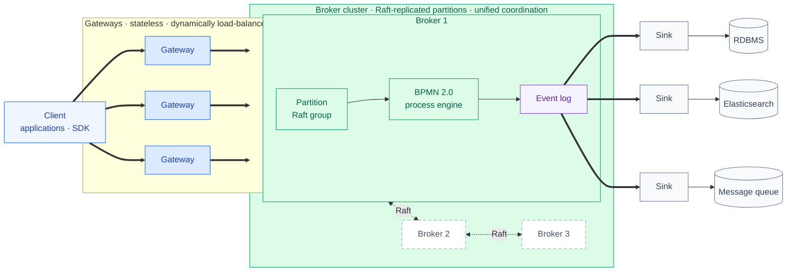

# Engine for Microservices Orchestration

Kunpeng provides visibility into and control over business processes that span multiple microservices.

## How it works

Clients spread load dynamically across stateless gateways, which route each request to the leading partition of a Raft group. There the BPMN 2.0 engine executes processes and appends every step to the partition's event log; the same log fans out through multiple sinks into multiple external stores — resumable, and off the execution path.

**Why Kunpeng?**

* Define processes visually in [BPMN 2.0](https://www.omg.org/spec/BPMN/2.0.2/)
* Choose your programming language
* Deploy with [Docker](https://www.docker.com/) and [Kubernetes](https://kubernetes.io/)
* Build processes that react to messages from [Kafka](https://kafka.apache.org/) and other message queues
* Scale horizontally to handle very high throughput
* Fault tolerance (no relational database required)
* Export process data for monitoring and analysis
* Engage with an active community

## Licenses

### 1. Use License

1. [APACHE-2.0](./licenses/APACHE-2.0.txt)
2. [GNU-AGPL-3.0](./licenses/GNU-AGPL-3.0.txt)
3. [MPL 2.0](./licenses/MPL-2.0.txt)

### 2. License Notice

1. For details about the file license, see the file header
2. Please do not touch the copyright headers, we need to keep their copyright on their files. On new files we create, we
   will have our License headers with our copyright.
3. Where agreement compatibility permits, most of the files have been added with our own copyright header(We made
   extensive adjustments to the file to allow for quick iteration).
