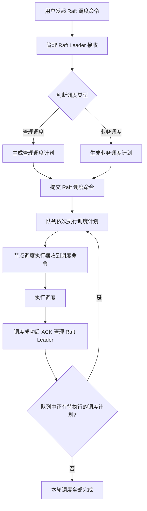
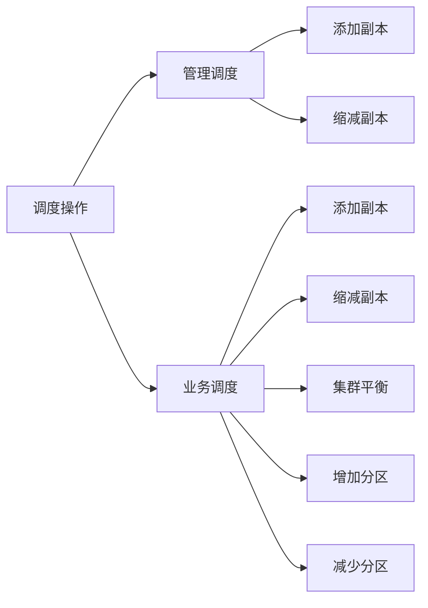

# 集群调度子系统技术设计

> 模块：`com.anyilanxin.kunpeng.cluster`（调度命令下发与执行链路）。
> 本文描述集群调度的整体流程与管理/业务两类调度的范围边界。

---

## 1. 背景与目标

集群在运行过程中需要对成员与分区进行动态调整（副本增减、扩缩容、负载平衡等）。
所有调整以**调度命令**的形式发起，经管理 Raft 仲裁后生成**调度计划**，
再由各节点的调度执行器串行消费执行，保证同一时刻全局只推进一个调度动作。

核心约束：

1. **串行执行**：调度计划进入队列后依次执行，前一个完成并 ACK 后才开始下一个。
2. **统一流程**：管理调度与业务调度走完全相同的流转链路，仅允许的操作集合不同。
3. **集中仲裁**：最终以管理 Raft Leader 为准，执行结果必须回 ACK 到 Leader。

---

## 2. 整体调度流程

### 2.1 关键步骤说明

| 步骤 | 说明 |
|---|---|
| 发起调度命令 | 用户提交调度请求，命令先落到管理 Raft |
| 判断调度类型 | 管理侧区分该命令作用于管理面还是业务面 |
| 生成调度计划 | 按当前集群拓扑生成具体要执行的调度动作序列 |
| 提交 / 入队 | 计划作为 Raft 命令复制落盘，由队列依次弹出执行 |
| 节点执行器执行 | 目标节点的调度执行器消费命令并实际变更本地状态 |
| ACK 回流 | 执行成功后向管理 Raft Leader 回执，Leader 放行下一条计划 |

> 注：执行失败的路径（重试 / 跳过 / 中止策略）暂未定义，属于待决策事项。

---

## 3. 管理调度与业务调度

两类调度的**整体流程完全一致**，差异仅在各自允许的调度操作范围：

| 维度 | 管理调度 | 业务调度 |
|---|---|---|
| 流转链路 | 同 §2 整体流程 | 同 §2 整体流程 |
| 允许的调度操作 | 添加副本、缩减副本 | 添加副本、缩减副本、集群平衡、增加分区、减少分区 |

---

## 4. 待决策事项

1. **失败处理**：单条计划执行失败时是否重试、是否阻断后续计划的执行。
2. **计划可见性**：调度进度是否需要暴露查询接口供用户追踪。
