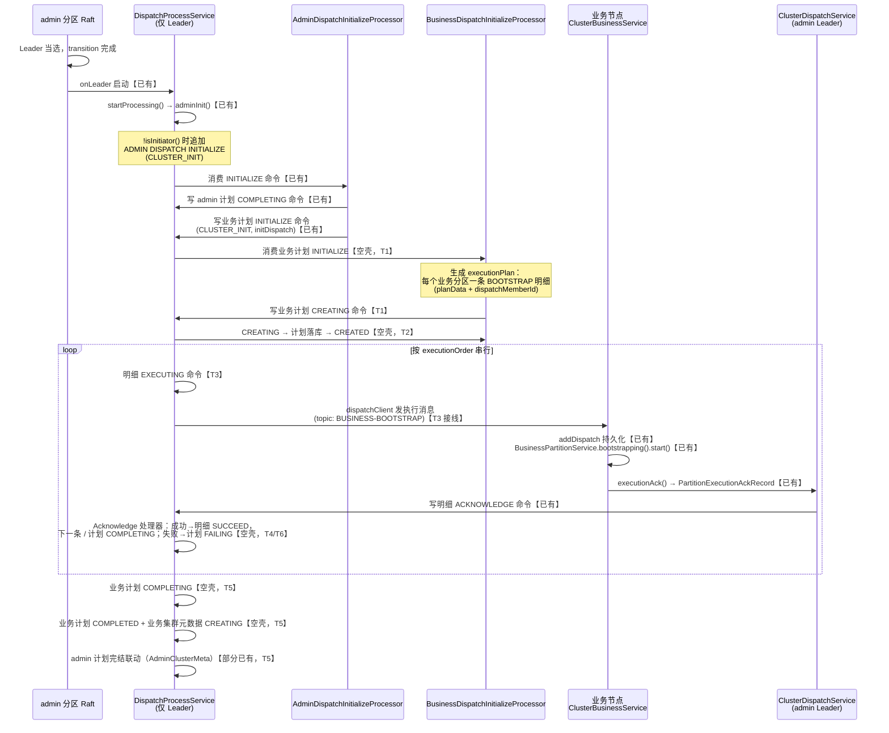
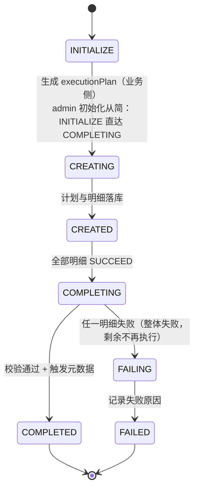
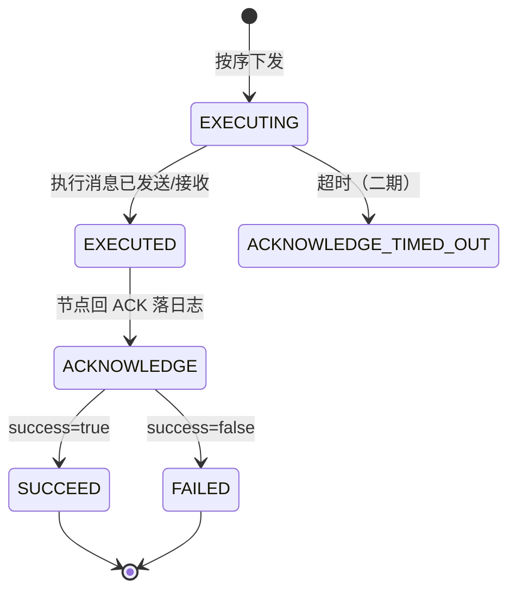

# 集群调度一期开发文档：集群初始化调度（CLUSTER_INIT）

> 模块：`com.anyilanxin.kunpeng.cluster.dispatch`（含 `cluster-admin`、`broker-admin-client` 协作模块）。
> 上游设计：[CLUSTER_DISPATCH_DESIGN.md](./CLUSTER_DISPATCH_DESIGN.md)（整体流程与两类调度边界）。
> 本文是一期（集群初始化调度）的详细设计与任务拆解，标注了每一环的现状（【已有】/【空壳】/【待新增】）。

---

## 1. 文档说明

### 1.1 定位

- 一期目标方案详设：端到端链路、状态机、代码点位、现状差距。
- 一期开发任务拆解：任务顺序、依赖关系、验收标准，可直接照此实施。

### 1.2 术语

| 术语 | 含义 |
|---|---|
| 调度计划（Plan） | 一次调度事件的顶层实体，`AdminDispatchPlanRecord` / `PartitionSourceRecord`，含依次执行的明细列表 |
| 执行明细（Execution） | 计划拆分后的单条调度动作，`AdminDispatchPlanExecutionRecord` / `BusinessDispatchPlanExecutionRecord` |
| 管理分区（admin partition） | 集群管理面 Raft 分区，调度命令的唯一仲裁点 |
| 业务 Raft / 业务分区 | 承载数据的业务面 Raft 分区组，调度动作的实际作用对象 |
| Leader | 特指 admin 分区 Raft Leader；调度流处理服务只在其上运行 |

---

## 2. 背景与一期目标

### 2.1 两期规划

- **一期（本文）**：集群初始化调度（`CLUSTER_INIT`）全链路闭环 —— 集群首次组建时，自动完成业务分区创建（等价于一次 `PARTITION_SCALE_UP_DISPATCH` 增加分区调度）并回流确认、更新元数据。
- **二期**：在闭环骨架上接入其余调度类型（增加/减少分区、副本增减、集群平衡），并补齐失败重试/阻断策略与 ACK 超时监听。

### 2.2 一期范围边界

| 做 | 不做（记入 §8） |
|---|---|
| admin 分区 Leader 当选后自动触发初始化调度 | 初始化幂等守卫（重启/重选举会重复触发，一期接受） |
| 管理计划流转（现状实现梳理保留，管理端初始调度从简） | 管理端初始调度的复杂计划编排 |
| 业务计划生成：`CLUSTER_INIT` → 增加分区执行明细 | 其余 `BusinessDispatchType` 的计划生成 |
| 执行明细逐条下发 + ACK 回流 + 明细完结 | ACK 超时监听（仅预留挂点，见 §4.4） |
| 业务计划完结 → 业务集群元数据落库 | 失败重试策略（仅最小 FAILED 闭环） |

---

## 3. 端到端总体流程

现状与目标的差距一览：

| 环节 | 现状 | 缺口 |
|---|---|---|
| 触发与 admin 计划 | 【已有】 | 无 |
| 业务计划生成 | 【空壳】`BusinessDispatchInitializeProcessor` 仅打印 | 执行明细生成规则（§4.3） |
| 计划落库与启动 | 【空壳】`BusinessDispatchChangePartitionProcessor` 仅打印 | 计划/明细持久化 + 首条下发 |
| 执行下发 | 【已有】接收侧（`ClusterBusinessService.handleBootstrap`）；【空壳】发送侧执行处理器 | EXECUTING → 发消息接线 |
| ACK 回流 | 【已有】`ClusterDispatchService.handle` 写 ACKNOWLEDGE 命令 | ACKNOWLEDGE 消费处理 |
| 计划完结与元数据 | admin 侧【部分已有】（`AdminDispatchCompleteProcessor` 写 `AdminClusterMeta`）；业务侧【空壳】 | 完结判定 + 元数据落库 + admin 计划联动 |
| 失败路径 | 【空壳】Fail 处理器全部为空 | 最小 FAILED 闭环 |

---

## 4. 分阶段详设

### 4.1 初始化触发（raft 就绪 → adminInit）【已有】

1. admin 分区 Raft 完成 Leader 选举后，`AdminPartitionTransitionStep` 的 transition 步骤链依次执行；
   `DispatchProcessServiceTransitionStep.onLeader()` 创建并提交 `DispatchProcessService` actor
   （`onFollower`/`onInactive` 均关闭，保证调度流处理全局仅 Leader 单点）。
2. `DispatchProcessService.onActorStarted()` → 车道池（`LanePool`）启动完成 → `startProcessing()`：
   注册日志监听、启动 `ClusterDispatchService`（ACK 接收面），最后执行 `adminInit()`。
3. `adminInit()`（DispatchProcessService.java:402）：
   - 读取 `clusterMetaStore.getAdminConfiguration()`；
   - **触发条件：`!adminConfiguration.isInitiator()`**（发起者节点在 cluster-config 阶段已完成初始写入，
     非发起者在 admin Raft 就绪后补写初始调度命令）；
   - 构造 `AdminDispatchPlanRecord`：`dispatchPlanType=CLUSTER_INIT`，
     `meta=PartitionInfoMetaRecord.fromMetadata(adminPartition)`（初始拓扑快照），
     生命周期 `AdminDispatchPlanLifeCycle.INITIALIZE`，经 `RecordAppendEntryFactory` 直写日志。

> 现状注意：`adminInit()` 中 `lastMetaRecord` 构造后未使用（死代码）；`AdminDispatchPlanRecord` 未显式设置
> `dispatchPlanId`（默认 -1），后续 COMPLETING 命令的 key 也为 -1。见 §8 待决策。

### 4.2 管理计划流转（INITIALIZE → COMPLETING → 集群元数据）【已有，从简】

管理端初始调度一期从简，不走 CREATING/CREATED 与执行明细：

1. `AdminDispatchChangeReplicationProcessor`（生命周期 INITIALIZE）：
   - `value.setInitDispatch(true)` 后直接写 admin 计划 **COMPLETING** 命令（key=计划 ID）；
   - 同时创建业务计划 `PartitionSourceRecord`：`dispatchPlanId=writer.nextKey()`（新键），
     `applyPlan=true`、`initDispatch=true`、`dispatchPlanType=CLUSTER_INIT`，
     写业务计划 **INITIALIZE** 命令 —— 由此进入业务侧主链路。
2. `AdminDispatchCompleteProcessor`（生命周期 COMPLETING）：
   - 读取 `repositoryAdmin.getClusterMeta()`，构造新 `AdminClusterMetaRecord`
     （`replicationFactor=1`、`currentReplicationFactor=meta.getPartitionMembers().size()`、版本递增）；
   - `initDispatch=true` 时写 `AdminClusterMetaLifeCycle.CREATING` 命令，否则 `UPDATING`。

### 4.3 业务计划生成（BUSINESS INITIALIZE → executionPlan）【空壳 → T1/T2】

初始化调度的执行语义是**增加分区**（`PARTITION_SCALE_UP_DISPATCH`）。`BusinessDispatchInitializeProcessor`
在收到业务计划 INITIALIZE 命令后完成"计划指定"：

1. **拓扑依据**：admin 计划携带的 `meta`（`PartitionInfoMetaRecord`，来自 admin 分区初始配置）给出初始
   业务分区数与每个分区组的成员列表。
2. **明细生成规则（每个业务分区组一条明细）**：
   - `executionOrder`：分区序号，从 0 开始，决定串行执行顺序；
   - `planData`：序列化后的 `PartitionBootstrapRecord`（`PartitionExecutionType.BOOTSTRAP` 负载，
     含 `partitionMeta`），即"引导一个业务分区"这一小功能动作；
   - `dispatchMemberId`：该明细的目标执行成员（该分区组的任一副本成员，一期取成员列表首个）；
   - `dispatchPlanExecutionId`：`writer.nextKey()` 生成。
3. **流转**：生成完成后写业务计划 **CREATING** 命令（key=计划 ID，requestId 沿用）。
4. **计划落库**：`BusinessDispatchChangePartitionProcessor`（CREATING）将计划与全部执行明细写入
   `repositoryBusiness`（applier `BusinessDispatchPlanCreatedApplierImpl` 已注册），随后写
   **CREATED** 命令，计划进入可执行状态。

### 4.4 执行下发与 ACK 回流（CREATED → 逐条 EXECUTING → SUCCEED）【混合 → T3/T4】

执行模型：**任意时刻每计划至多一条明细在途**，串行推进（由 admin Leader 上单线程流处理器天然保证）。

1. **下发（T3）**：`BusinessDispatchExecutionExecutingProcessor`（生命周期 EXECUTING）：
   - 将对应执行明细置 `EXECUTING` 并记录 `dispatchStartTime`（经 applier 持久化）；
   - 通过 `writer` 持有的 `dispatchClient` 向 `dispatchMemberId` 发送执行消息：
     topic = `getTopic(PartitionType.BUSINESS, PartitionExecutionType.BOOTSTRAP)`
     （即 `BUSINESS-BOOTSTRAP`），负载为该明细 `planData`。
2. **业务节点执行**【已有】：`ClusterBusinessService.handleBootstrap`：
   - `addDispatch(...)`：将调度信息持久化到本地 `ClusterRaftConfiguration`（`haveDispatch` 置位），
     重启后 `restartExecution()` 自动重放在途调度；
   - `BusinessPartitionService.bootstrapping(content).start()` 完成分区引导；
   - 成功后 `dispatchComplete(metadata)`：本地 raft 配置加入该分区元数据并清除在途标志；
3. **ACK 回流**【已有】：`executionAck()` 构造 `PartitionExecutionAckRecord`
   （`dispatchPlanExecutionId`/`dispatchPlanId`/`executionType`/`partitionType`/`executionMemberId`/`success`），
   经 `dispatchClient.ack()` 发往 admin Leader；
4. **ACK 落日志**【已有】：`ClusterDispatchService.handle`（topic `CLUSTER_DISPATCH_TOPIX`）
   按 `partitionType` 查 repository 中对应执行明细，写
   `BusinessDispatchPlanExecutionLifeCycle.ACKNOWLEDGE`（或 admin 侧 `ACKNOWLEDGE`）命令；
5. **ACK 消费（T4）**：`BusinessDispatchExecutionAcknowledgeProcessor`（生命周期 ACKNOWLEDGE，
   执行明细层的成败判定点）：
   - **成功**：明细置 `SUCCEED` 并记录 `dispatchEndTime`；计划内仍有未完成明细 → 写下一条
     （`executionOrder` 最小的 WAIT 明细）EXECUTING 命令；全部完成 → 写业务计划 **COMPLETING** 命令；
   - **失败**：本次调度计划**整体失败、立即终止**——剩余明细不再下发，直接反馈到调度计划层，
     写业务计划 **FAILING** 命令（T6）。
6. **ACK 超时（预留，一期不实现）**：每发起一条 EXECUTING 应注册超时定时（基础设施已具备：
   `TimerScheduler`/`LanePool` 车道定时，`BoundedPendingCommandRegistry` 已支持
   `ACKNOWLEDGE_TIMED_OUT` 在途去重）。一期仅保留 `BusinessDispatchExecutionAcknowledgeTimeOutProcessor`
   空处理器作为挂点，超时监听接入列入二期。

### 4.5 计划完结与元数据更新（COMPLETING → COMPLETED / FAILED）【空壳 → T5/T6】

1. **业务计划完结（T5）**：`BusinessDispatchCompleteProcessor`（生命周期 COMPLETING）：
   - 校验计划内全部明细 `SUCCEED`；
   - 写业务计划 **COMPLETED**；同时写 `BusinessClusterMetaLifeCycle.CREATING` 命令
     （初始化场景业务集群元数据首次创建）。
2. **业务集群元数据落库（T5）**：`BusinessClusterMetaCreateProcessor`（CREATING）将
   `BusinessClusterMetaRecord`（初始分区拓扑、副本数、版本）写入 `repositoryBusiness`。
3. **admin 计划联动（T5）**：业务计划 COMPLETED 后回写 admin 计划完结（admin 侧
   `AdminDispatchCompleteProcessor` 已在 COMPLETING 时更新 `AdminClusterMeta`，一期补齐
   admin 计划 COMPLETED 的落库联动，applier `AdminDispatchPlanCompletedApplierImpl` 已注册）。
4. **失败闭环（T6）**：失败反馈点在执行明细层 ACK 消费处（§4.4.5）。任一明细 `success=false` 即视为
   **整个调度计划失败，后续明细一律不再执行**：失败明细标记 `FAILED`（记录 `dispatchMessage`），
   剩余明细保持 `WAIT`（不再下发），直接写业务计划 **FAILING** 命令 → `BusinessDispatchFailProcessor`
   记录失败原因后写 **FAILED**。阻断语义一期即定；失败计划的重试策略二期决策。

---

## 5. 状态机

### 5.1 调度计划生命周期（admin/business 两套同构，值定义相同）

| 枚举 | 值 | 说明 |
|---|---|---|
| `INITIALIZE` | 7 | 初始化入口命令 |
| `CREATING` | 1 | 计划生成/落库中 |
| `CREATED` | 2 | 可执行 |
| `COMPLETING` | 3 | 明细全部完成，校验与元数据更新中 |
| `COMPLETED` | 4 | 终态 |
| `FAILING` | 5 | 失败处理中 |
| `FAILED` | 6 | 终态 |

> admin 侧：`AdminDispatchPlanLifeCycle`（recordIndex=18）；业务侧：`DelayedLifeCycle`（recordIndex=21）。

### 5.2 执行明细生命周期（admin/business 同构）

> 状态归属：`EXECUTED` 由下发侧在**发起执行消息前**置位（T3：先落库后异步发送，发送成败不回写
> `EXECUTED`，失败兜底依赖二期超时监听）；终态（SUCCEED/FAILED）由 ACKNOWLEDGE
> 命令驱动（T4）。`EXECUTING → EXECUTED → ACKNOWLEDGE` 的顺序由命令序列天然保证。

### 5.3 关联元数据生命周期

- `AdminClusterMetaLifeCycle`：`CREATING`（initDispatch）/ `UPDATING` —— 由 `AdminDispatchCompleteProcessor` 触发【已有】。
- `NodeSourceLifeCycle`：`CREATING` / `UPDATING` / `DELETING` —— 一期使用 `CREATING`【T5】。

---

## 6. 代码点位索引

状态：【已有】可用｜【空壳】已注册无逻辑｜【待新增】需新建

| 组件 | 位置（cluster-dispatch 模块根：`kunpeng/cluster/cluster-dispatch/src/main/java/com/anyilanxin/kunpeng/cluster/dispatch/`） | 状态 |
|---|---|---|
| 调度流处理服务 | `DispatchProcessService`（adminInit: L402；startProcessing: L276） | 【已有】 |
| Leader 转换接线 | `cluster-admin/.../transition/dispatch/DispatchProcessServiceTransitionStep`（onLeader 启动） | 【已有】 |
| 日志写入门面 | `LogEventWriter`（addCommand/addEvent/nextKey） | 【已有】 |
| admin 计划处理器 | `command/admin/dispatch/processor/AdminDispatchInitializeProcessor` | 【已有】 |
| 同上 | `.../AdminDispatchCompleteProcessor`（COMPLETING → AdminClusterMeta） | 【已有】 |
| 同上 | `.../AdminDispatchCreateProcessor` / `.../AdminDispatchFailProcessor` | 【空壳】 |
| admin 执行处理器 | `command/admin/execution/processor/AdminDispatchExecution{Executing,Acknowledge,AcknowledgeTimeOut}Processor` | 【空壳】 |
| 业务计划处理器 | `command/business/dispatch/processor/BusinessDispatchInitializeProcessor` | 【空壳】★T1 |
| 同上 | `.../BusinessDispatchCreateProcessor` | 【空壳】★T2 |
| 同上 | `.../BusinessDispatchCompleteProcessor` / `.../BusinessDispatchFailProcessor` | 【空壳】★T5/T6 |
| 业务执行处理器 | `command/business/execution/processor/BusinessDispatchExecution{Executing,Acknowledge,AcknowledgeTimeOut}Processor` | 【空壳】★T3/T4 |
| 业务元数据处理器 | `command/business/clustermeta/processor/BusinessClusterMeta{Create,Update,Delete}Processor` | 【空壳】★T5 |
| ACK 接收面 | `api/ClusterDispatchService`（handle → 写 ACKNOWLEDGE 命令） | 【已有】 |
| 执行消息接收 | `cluster-admin/.../business/ClusterBusinessService`（BOOTSTRAP/JOIN/LEAVE/CONFIG_CHANGE/DATA_MERGE + addDispatch/restartExecution/executionAck） | 【已有】 |
| 下发客户端 | `broker-admin-client/.../impl/DefaultClusterDispatchClient`（命令 API + ack） | 【已有】 |
| 计划记录 | `protocol-admin-impl/.../admin/AdminDispatchPlanRecord`、`.../business/BusinessDispatchPlanRecord` | 【已有】 |
| 执行明细记录 | `.../admin/AdminDispatchPlanExecutionRecord`、`.../business/BusinessDispatchPlanExecutionRecord`（多 `dispatchMemberId` 字段） | 【已有】 |
| 生命周期枚举 | `protocol-admin/.../admin/AdminDispatchPlanLifeCycle`（+Execution）、`.../business/BusinessDispatchPlanLifeCycle`（+Execution） | 【已有】 |
| 执行类型 | `protocol-admin/.../PartitionExecutionType`（BOOTSTRAP/JOIN/LEAVE/CONFIG_CHANGE/DATA_MERGE） | 【已有】 |
| 处理器注册 | `command/admin/AdminProcessorRegister`（AdminDispatch/AdminExecution/AdminClusterMeta 三组）、`command/business/BusinessProcessorRegister`（对应三组） | 【已有】 |
| repository applier | Plan/Execution 的 Created/Completed/Failed/Executed/Succeed/Failed Applier 均已注册 | 【已有】 |

> 处理器三层职责（admin/business 同构）：
> - `command/*/dispatch/processor` —— **计划层**：计划生命周期流转（生成/落库/完结/失败）；
> - `command/*/execution/processor` —— **执行明细层**：单条明细下发与 ACK 成败判定（成功推进下一条，失败直接反馈计划层）；
> - `command/*/clustermeta/processor` —— **元数据层**：计划完结后集群元数据落库。

---

## 7. 任务拆解

依赖顺序：T1 → T2 → T3 → T4 → T5 →（T6 可与 T5 并行）→ T7。管理侧计划流转（§4.2）为现状梳理，不单列任务。

### T1 业务计划生成（`BusinessDispatchInitializeProcessor`）

- 改动点：
  - 计划类型保持 `CLUSTER_INIT`（标识初始化来源），执行明细按 `PARTITION_SCALE_UP_DISPATCH`
    （增加分区）语义生成；
  - 依据 admin 计划 `meta`（`PartitionInfoMetaRecord`）生成 `executionPlan`：每个业务分区一条
    `BusinessDispatchPlanExecutionRecord`（`executionOrder`、`planData=PartitionBootstrapRecord 序列化`、
    `dispatchMemberId`、`dispatchPlanExecutionId=writer.nextKey()`）；
  - 写业务计划 CREATING 命令（key=`dispatchPlanId`，沿用 `record.getRequestId()`）。
- 验收：INITIALIZE 命令消费后，日志中出现 CREATING 命令且 `executionPlan` 与初始分区数一致。

### T2 计划落库与启动（`BusinessDispatchChangePartitionProcessor`）

- 改动点：
  - 计划与明细写入 `repositoryBusiness`（走 applier）；
  - 写 CREATED 命令；CREATED 后触发首条（`executionOrder=0`）明细 EXECUTING 命令。
- 验收：repository 中可查到计划与明细记录，状态 CREATED；首条明细进入 EXECUTING。

### T3 执行下发（`BusinessDispatchExecutionExecutingProcessor`）

- 改动点：
  - 明细置 EXECUTING、记录 `dispatchStartTime`（applier 持久化）；
  - 经 `dispatchClient` 向 `dispatchMemberId` 发送 `BUSINESS-BOOTSTRAP` 执行消息（负载=`planData`）。
- 依赖：接收侧 `ClusterBusinessService.handleBootstrap` 已实现，无需改动。
- 验收：目标节点收到消息并完成分区引导（`BusinessPartitionService` 启动、本地 raft 配置新增分区）。

### T4 ACK 消费与推进（`BusinessDispatchExecutionAcknowledgeProcessor`）

- 改动点：
  - ACK 成败判定：`success=true` → 明细 SUCCEED + `dispatchEndTime`；`success=false` → 失败反馈，
    直接转入计划失败流程（T6）；
  - 成功路径：有剩余 WAIT 明细 → 写下一条 EXECUTING；全部完成 → 写计划 COMPLETING。
- 验收：多分区场景明细按序逐条 SUCCEED；执行期间任意时刻至多一条在途。

### T5 计划完结与元数据（`BusinessDispatchCompleteProcessor` + `BusinessClusterMetaCreateProcessor` + admin 联动）

- 改动点：
  - COMPLETING：校验全部 SUCCEED → 写 COMPLETED + `BusinessClusterMetaLifeCycle.CREATING` 命令；
  - CREATING：`BusinessClusterMetaRecord` 落库 `repositoryBusiness`；
  - admin 侧：业务计划完成后补齐 admin 计划 COMPLETED 落库联动。
- 验收：初始化结束后 `AdminClusterMetaRecord`、`BusinessClusterMetaRecord` 均存在且版本为 1，admin/业务计划终态 COMPLETED。

### T6 失败最小闭环（`BusinessDispatchFailProcessor` + `BusinessDispatchExecutionAcknowledgeProcessor` 失败分支）

- 改动点：`BusinessDispatchExecutionAcknowledgeProcessor` 判定 `success=false` 时整个计划失败——
  失败明细标记 FAILED（记录 `dispatchMessage`）、剩余明细保持 WAIT 不再下发，并直接写计划 FAILING
  命令（失败反馈点在执行明细层 ACK 消费处，跨 execution/dispatch 两层处理器）；
  `BusinessDispatchFailProcessor` 记录失败原因后写 FAILED。
- 验收：注入引导失败（如成员不可达）后，计划终态 FAILED，剩余明细不再进入 EXECUTING，失败原因可查。

### T7 端到端验证

- 单节点：启动 → admin Raft 就绪 → 自动初始化 → 业务分区创建 → 元数据落库，全程无人工干预；
- 多节点（≥3）：任意节点发起（含非发起者作为 Leader 当选者）均能完成闭环；
- 重启：执行中途重启，`restartExecution()` 重放在途调度后闭环可继续；
- 回归：重复启动（已初始化集群）行为记录归档（一期允许重复触发，见 §8）。

---

## 8. 已知风险与待决策

| # | 事项 | 说明 | 处理 |
|---|---|---|---|
| 1 | **无初始化幂等守卫** | `adminInit()` 无"是否已初始化"检查；Leader 重选举/进程重启会重复追加 INITIALIZE 命令 | 一期接受（已确认）；二期以 `haveDispatch` 标志或 `clusterMeta` 存在性做守卫 |
| 2 | **触发条件语义** | 现状 `!isInitiator()`：仅非发起者补写初始调度；发起者的初始调度依赖 cluster-config 阶段写入 | 按现状描述；若初始化偶发缺失优先排查该条件 |
| 3 | admin 计划未设 `dispatchPlanId` | `adminInit()` 构造的计划 `dispatchPlanId=-1`，后续命令 key 亦为 -1 | 待决策：是否一期为初始计划分配真实键（`writer.nextKey()`） |
| 4 | `adminInit()` 死代码 | `lastMetaRecord` 构造后未使用 | 实施时顺手清理 |
| 5 | ACK 超时监听缺失 | 明细在途无超时兜底，节点失联将卡死计划 | 一期预留挂点（§4.4.6）；二期接入 TimerScheduler |
| 6 | 失败重试策略未定义 | 阻断语义已定：任一明细失败 → 计划整体失败、后续明细不再执行；失败计划是否/如何重新发起未定 | 二期决策（上游设计文档 §4 已列） |
| 7 | 常量拼写 `CLUSTER_DISPATCH_TOPIX` | `ClusterDispatchService.CLUSTER_DISPATCH_TOPIC` 值拼写为 TOPIX | 仅内部一致性使用；建议二期顺手更名 |
| 8 | `BusinessDispatchPlanExecutionRecord.planData` setter 差异 | 业务版 `setPlanData(byte[])` 不做 null 防护（admin 版有），生成明细时注意传参 | T1 实施时注意 |
