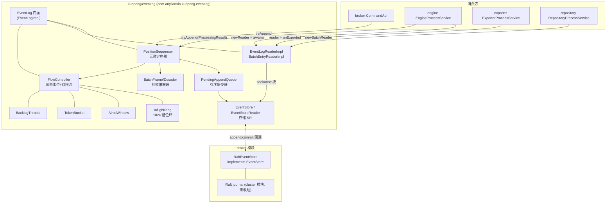
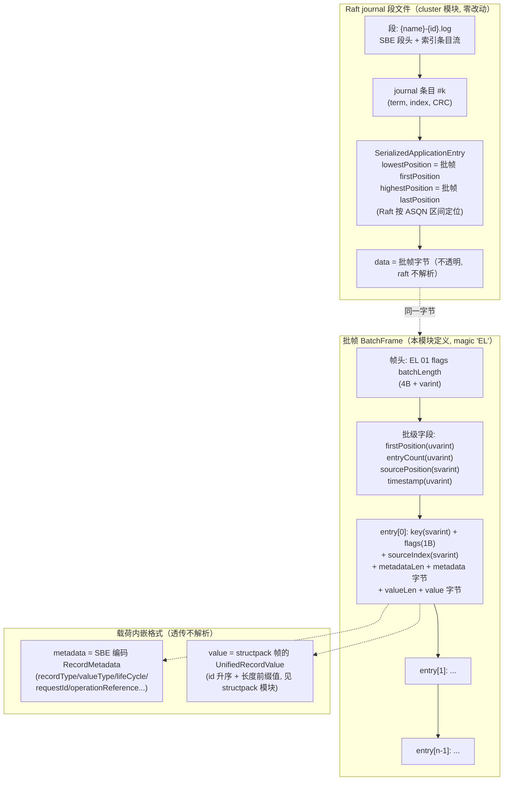
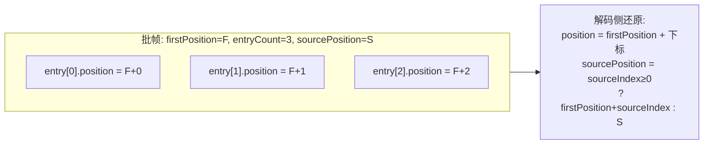
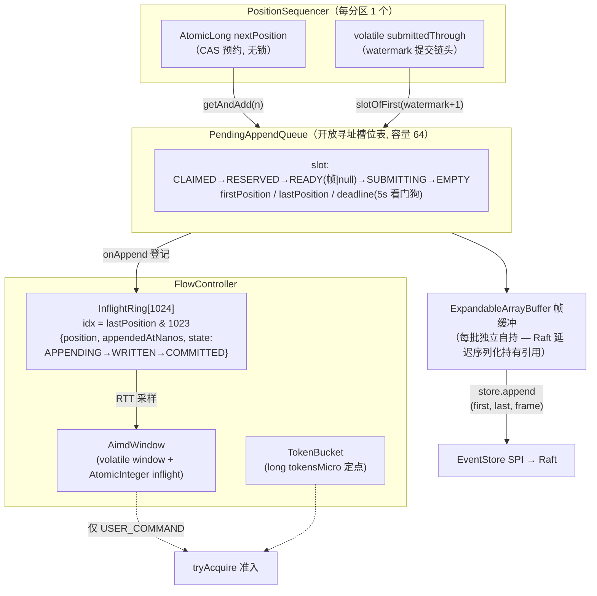
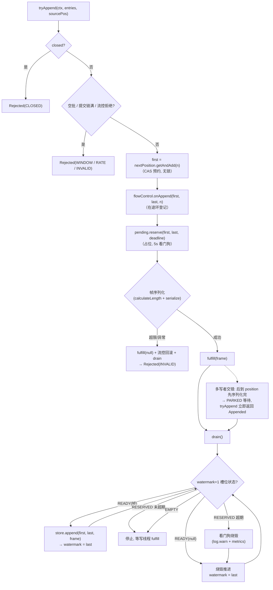
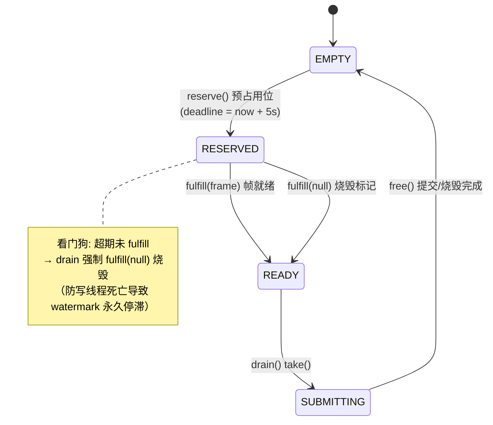
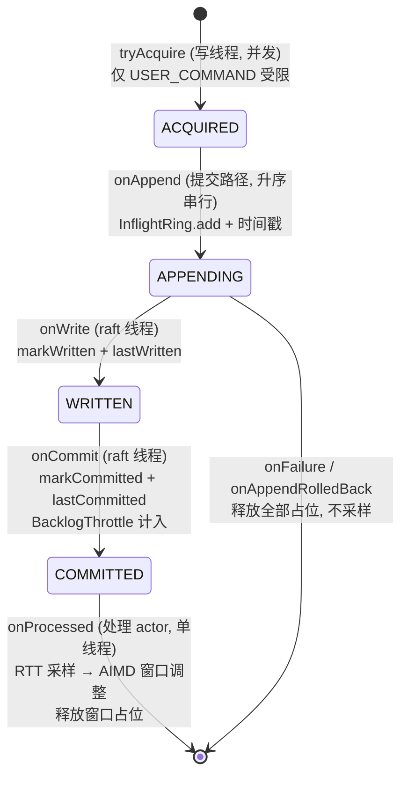
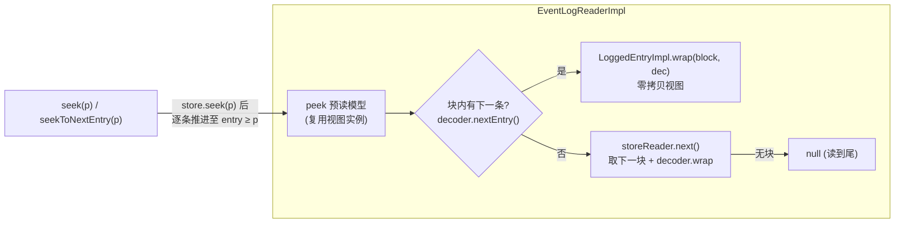

# EventLog设计文档

> 版本：v1 | 模块：`kunpeng/eventlog`（包 `com.anyilanxin.kunpeng.eventlog`）
> 定位：事件日志流——定序、批帧编解码、流控、拉读、commit 通知、恢复，为引擎提供分区级事件日志抽象
> 配套文档：[性能报告](./eventlog-performance-estimate.md)

## 1. 设计目标

| 目标 | 含义 |
|------|------|
| 高吞吐追加 | 无锁 position 预约 + 有序提交链，多写者仅提交段串行 |
| 紧凑帧格式 | varint 批帧，批级共享字段，同数据体积最小化 |
| 自适应流控 | AIMD 在途窗口 + 令牌桶速率 + 积压调节，热路径 O(1) 零分配 |
| 崩溃安全 | 失败区间烧毁产生 gap、读者容忍；恢复经 seekToEnd 续号 |
| 协议解耦 | entry 的 metadata/value 为不透明字节，不依赖 protocol/protocol-impl |
| 轻依赖 | 仅 structpack（缓冲工具）/ agrona / slf4j / micrometer |

## 2. 总体架构



**分层职责**：

- **门面层** `EventLog`：恢复（seekToEnd 找回 lastPosition）、reader/writer 工厂、commit→通知分发
- **定序层** `PositionSequencer`：position 乐观预约 + 有序提交链 + 看门狗
- **流控层** `FlowController`：三态水位 + AIMD 窗口 + 令牌桶 + 积压调节
- **序列化层** `BatchFrame/Decoder`：批帧编解码（varint，值自界定）
- **读层**：拉取式游标 + 按源聚合批读
- **SPI 层** `EventStore`：追加块 + 提交通知 + 读游标（Raft 桥接点在 broker 侧）

## 3. 批帧格式 v1

**代码级事实源**：`serialize/BatchFrame.java` 的公开常量（magic/版本/标志位）。varint 变长只支持顺序解析，仅有的两个消费者（BatchFrame 写侧 / BatchFrameDecoder 读侧）同包直引常量，无需独立描述符。

小端 LEB128 varint、无对齐无 padding（Raft journal 顺序消费，无需对齐）。

```text
偏移   字段                类型          说明
0x00   magic               2B            0x45 0x4C ("EL") —— 注意不可用 "KP"(structpack 已占)
0x02   version             1B            0x01
0x03   flags               1B            bit0 预留 CRC
0x04   batchLength         uvarint32     本字段之后到帧尾的字节数
────── 以下计入 batchLength ──────
       firstPosition       uvarint64     批首 position（恒 ≥1）
       entryCount          uvarint32
       sourcePosition      svarint64     批级源 position（-1 = 无）
       timestamp           uvarint64     批级毫秒时间戳（同批同时间戳）
       entry[entryCount]:
         key               svarint64     -1 = null key
         entryFlags        1B            bit0 = skipProcessing
         sourceIndex       svarint32     -1 = 无；批内回指（见 §3.1）
         metadataLen       uvarint32 + bytes
         valueLen          uvarint32     + bytes
```

设计要点：position/timestamp 批级存一次（条目 position 由 `firstPosition + 下标` 推算），条目头部仅 6–12B varint。

### 3.1 sourcePosition 语义

```text
entry.sourcePosition = sourceIndex ≥ 0 ? firstPosition + sourceIndex : 批级 sourcePosition
```

批内回指把解析放在读侧，写侧不再逐条存绝对值。

### 3.2 端到端数据结构图（磁盘 → 批帧 → 条目 → 载荷）

一次 `tryAppend` 产生的数据在物理存储中的完整嵌套结构：



**position 体系**（一个批帧承载连续区间）：



### 3.3 批帧字节布局实例（2 条目，可手工复算）

以 `firstPosition=1001, sourcePosition=-1, timestamp=1500`，entry0 = `{key:-1, flags:0, sourceIndex:-1, meta:16B, value:48B}`，entry1 = `{key:42, flags:skipProcessing, sourceIndex:0, meta:16B, value:32B}` 为例：

```text
偏移    字节                 字段                          说明
──────────────────────────────────────────────────────────────────
0x00    45 4C                magic "EL"                    误定位/格式快速识别
0x02    01                   version
0x03    00                   flags                         bit0 预留 CRC
0x04    80 01                batchLength = 128 (uvarint)   本字段之后到帧尾
────── 以下计入 batchLength ──────────────────────────────────────
0x06    E9 07                firstPosition = 1001          批级, 2B
0x08    02                   entryCount = 2
0x09    01                   sourcePosition = -1 (zigzag→1)
0x0A    DC 0B                timestamp = 1500              批级毫秒
────── entry[0]（position=1001）─────────────────────────────────
0x0C    01                   key = -1 (zigzag→1)           条目头 4B + 长度前缀
0x0D    00                   entryFlags
0x0E    01                   sourceIndex = -1 (zigzag→1)
0x0F    10                   metadataLen = 16
0x10    ‹16B›                metadata（SBE 字节, 透传）
0x20    30                   valueLen = 48
0x21    ‹48B›                value（structpack 帧字节, 透传）
────── entry[1]（position=1002）─────────────────────────────────
0x51    54                   key = 42 (zigzag→84)
0x52    01                   entryFlags = skipProcessing
0x53    00                   sourceIndex = 0                → source = 1001+0 = 1001
0x54    10                   metadataLen = 16
0x55    ‹16B›                metadata
0x65    20                   valueLen = 32
0x66    ‹32B›                value
──────────────────────────────────────────────────────────────────
帧总长 = 134 B（载荷 112B，协议开销 22B）
```

### 3.4 运行期数据结构（写路径内存视图）



关键内存约束：在途批数 ≤ 提交链容量 64 ≪ 在途环 1024（槽位复用必在旧批释放后）；帧缓冲生命周期 = append 调用 → Raft 落盘序列化完成（`onWrite`），期间不可复用。

## 4. 无锁定序器

### 4.1 状态与不变量

| 不变量 | 保证机制 |
|--------|----------|
| I1 position 唯一严格递增，批内连续 | `AtomicLong.getAndAdd(count)` 预约，无临界区 |
| I2 `EventStore.append` 调用序 == firstPosition 升序 | watermark 提交链（`submittedThrough`） |
| I3 帧缓冲每批独立自持 | Raft 延迟序列化持有引用（`UnserializedApplicationEntry.toSerializable` 在落盘时才读），不可复用线程本地缓冲 |
| I4 position 只进不退 | 失败区间烧毁产生 gap，读者容忍 |

### 4.2 写入路径流程图



**快路径（单写者常态）**：预约（1 次 CAS）→ 序列化（无锁区）→ `drain`（无竞争监视器，槽位即自身）→ append。`synchronized` 仅覆盖已就绪槽位的逐个提交，**不含 position 分配与帧序列化**——追加的并行区最大化。

### 4.3 槽位状态机



### 4.4 失败语义

| 失败点 | 处理 | position |
|--------|------|----------|
| 流控拒绝 | 未预约即返回 | 不消耗 |
| 帧超限/序列化异常 | `fulfill(null)` + 流控回滚 | 烧毁（gap） |
| `store.append` 同步异常 | `flowControl.onFailure` | 烧毁（gap），仍返回 Appended |
| Raft 异步 onFailure | 同上 | 烧毁 |
| 写线程卡死于 reserve/fulfill 之间 | 看门狗 5s 烧毁 | 烧毁 |

## 5. 流控

### 5.1 三态水位与线程契约



### 5.2 双限流

**AimdWindow**（在途窗口，仅 USER_COMMAND）：

- 窗口 clamp [min=10, max=1000]，初值 100；`AtomicInteger` in-flight CAS 计数
- RTT 梯度 = EMA(α=0.2) / minRTT；`梯度 < 1 + 容差(0.1)` → 窗口 +1（线性增）；超限 → `window × (1 - 0.5×(1-1/梯度))` 乘性减
- 窗口调整按成功次数节流（每 100 次一次），防振荡
- `FlowControlParams.disabled()` 一键关闭（退化纯记账）

**TokenBucket**（写入速率）：

- nanoTime 定点补充（tokens 以 1e-6 精度 long 计），permits = 批 entry 数
- 短 `synchronized`（写路径低频、无浮点争用）；速率可被 BacklogThrottle 动态重设

**InflightRing**（1024 预分配槽，按 lastPosition 取模）：

- 全部转移 O(1) 数组下标，零分配零装箱
- 正确性：在途批数被提交链槽数（≤64）约束 ≪ 1024，槽位复用必然发生在旧批释放后

**BacklogThrottle**：written-exported 积压每 10s 至多调节一次，`有效速率 = clamp(观察速率 × 可接受积压/实际积压, minThrottle, 上限)`。

## 6. 读路径



- seek 族语义：`seek(p)` 命中 position==p 或最近大于项；`seekToEnd()` 返回 lastPosition（空日志 0），供恢复续号
- gap（烧毁区间）表现为 position 跳跃，不报错
- `BatchEntryReader`：同一 sourcePosition 的**连续**条目归为一批（处理单条源事件的结果连续存放），`head()` 经 `reader.seek` 回卷重放

## 7. 存储 SPI（Raft 桥接点）

```java
interface EventStore {
  EventStoreReader newReader();
  void append(long firstPosition, long lastPosition, BufferWriter block, AppendListener listener);
  void addCommitListener(CommitListener listener);  // onCommit() 无参——"有新数据可读"
  interface AppendListener { onWrite(index,last); onCommit(index,last); onFailure(last,cause); }
}
interface EventStoreReader extends Iterator<DirectBuffer> { void seek(long position); }
```

- **契约**：append 调用序 == firstPosition 升序（定序器保证）；onFailure 后该批永不 onCommit；`seek(p)` 越界钳到首/末块（seek(MAX_VALUE) = 末块，供 seekToEnd）
- **数据所有权**：块在 append 返回后仍可能被异步读取（至 onWrite），实现须自持数据——定序器每批独立 `ExpandableArrayBuffer` + `DirectBufferWriter` 视图满足
- broker 侧：`RaftEventStore/RaftEventStoreReader/RaftAppendListenerAdapter` 三件套实现该 SPI，桥 `LogAppender`（onWriteError/onCommitError → onFailure 的转发语义见桥接实现注释）
- **cluster 模块零改动**：firstPosition/lastPosition 写入 `SerializedApplicationEntry` 的 lowest/highestPosition，ASQN seek 映射不变

## 8. 指标与护栏

- 指标前缀 `eventlog.*`：追加/拒绝计数（按原因）、在途/水位 gauge、看门狗烧毁计数、窗口与速率当前值；typed 维度（recordType/valueType）由 protocol-impl 装饰器承接
- `DependencyGuardTest`：机器护栏，保证模块 classpath 不引入协议实现依赖

## 9. 风险与缓解

| # | 风险 | 缓解 |
|---|------|------|
| 1 | 帧格式演进（旧数据不兼容） | magic+version 前置校验，fail-fast 报错明确；升级 SOP 换数据目录 |
| 2 | 有序提交链停摆 | finally 推进 + 5s 看门狗烧毁 + 停摆 warn 日志/指标 |
| 3 | 多写者下 tryAppend 返回 Appended 但提交延后 | 结果语义定义"已定序"；消费方（engine）只信 commit 通知 |
| 4 | AIMD 参数不当引起振荡 | 保守默认 + disabled() 一键退化 + 行为单测；窗口调整按成功次数节流 |
| 5 | InflightRing 槽位错配 | 提交链槽数上限（64）≪ 环容量（1024）结构性保证；开发期冲突即抛 |
| 6 | 消费方迁移回归 | 每模块 buildSkipTest/test 门禁；桥接 helper 收敛在 protocol-impl 侧 |

## 10. 验证基线

| 项 | 验证方式                                             |
|----|------------------------------------------------------|
| 帧编解码 | 字节布局断言（§3.3 实例手工复算锚定）+ 回环/畸形单测 |
| 并发定序 | 多线程断言 append 调用序 == firstPosition 升序（I2） |
| 流控 | 三态水位状态机单测 + AIMD 行为单测 + 看门狗烧毁      |
| 读路径 | seek 族语义 + gap 跳跃 + 批读聚合                    |
| 依赖护栏 | DependencyGuardTest                                  |
| 性能 | 见[性能报告](./eventlog-performance-estimate.md)     |
