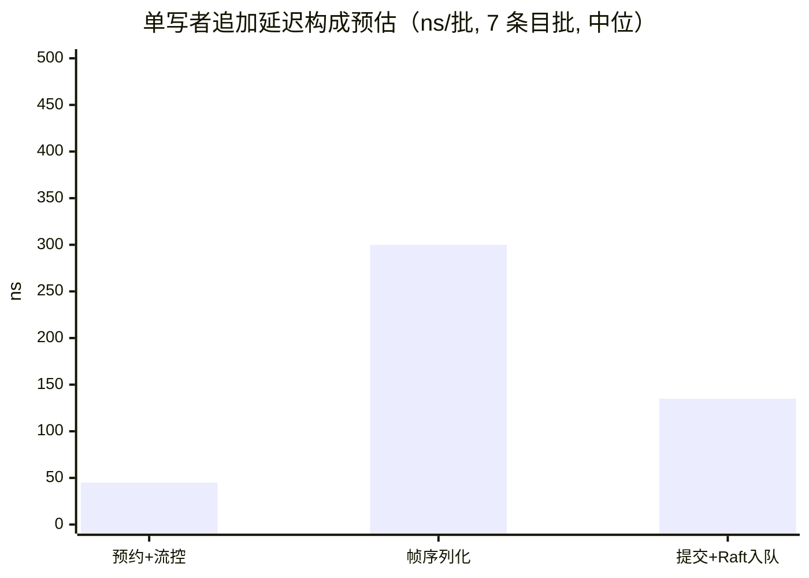
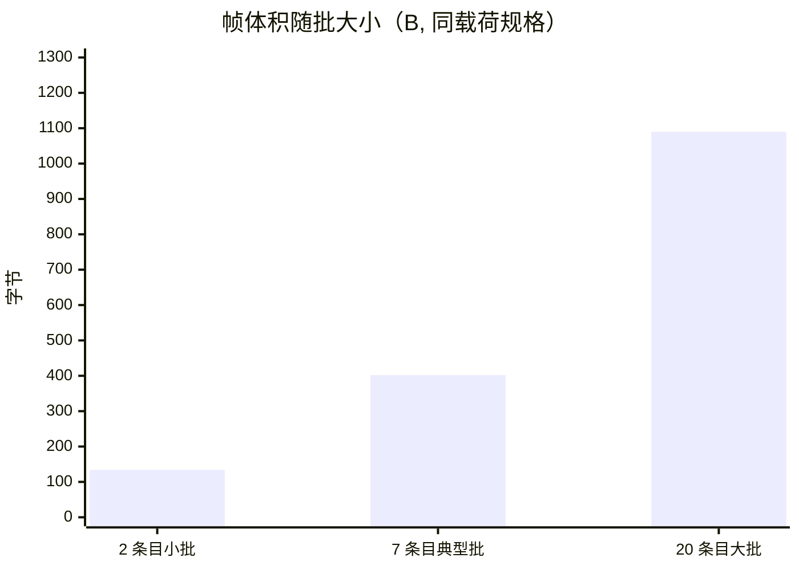
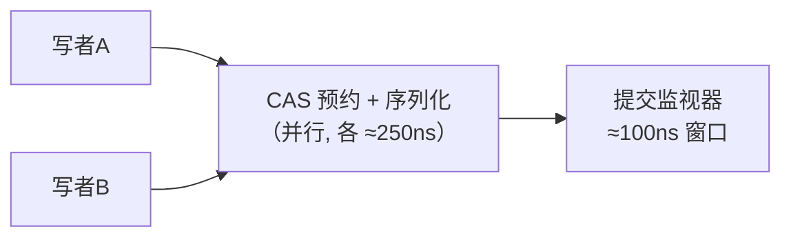

# EventLog 性能报告

> 版本：v1 | 方法：逐操作成本核算 + 字节账目 + 实测校准
> 配套：[设计文档](./eventlog-design.md)

## 0. 方法论与诚实声明

- **单点操作成本**取现代 CPU（Apple Silicon / JDK 25）典型值：无竞争 CAS ≈ 10–20ns、无竞争 `synchronized` ≈ 15–25ns、`ReentrantLock` 无竞争 acquire+release ≈ 20–40ns（有竞争退化至 µs 级）、volatile 读 ≈ 1ns、数组下标访问 ≈ 1–2ns
- **字节账目**来自帧格式的逐字段布局（可手工复算，见 §2）
- 本报告用途：① 论证设计的性能结构依据；② 给出后续基准的验收基线

## 1. 写路径（单写者常态）：逐操作成本

单次 tryAppend 的关键路径：

| # | 操作 | 机制 | 成本特征 |
|---|------|------|----------|
| 1 | 流控准入 | 窗口 `AtomicInteger.get` 比较 + 令牌桶短 `synchronized` | 无分配，纳秒级 |
| 2 | position 分配 | `getAndAdd`（1 次 CAS，锁外） | ≈10–20ns |
| 3 | 在途登记 | `InflightRing` 一次数组下标写 O(1) | ≈2–3ns，与负载无关 |
| 4 | 帧构造 | 批级头部一次 + 逐条 6–12B varint | 随条目数线性 |
| 5 | 提交 | `drain` 无竞争监视器内 `store.append`（Raft 入队） | 监视器仅覆盖已就绪槽位提交 |
| 6 | 锁开销 | 无全路径锁 | — |

**预估**：单写者 ≈ **430–500ns/批**（7 条目批，中位；流控 20 + 预约 15 + 槽位簿记 5 + 序列化 300 + Raft 入队 100）。

## 2. 帧体积：逐字节账目（确定性，可手工复算）

以"2 条目批（key=-1/42、16B metadata、48B/32B value、skipProcessing 一条、sourceIndex 一条）"为例（与设计文档 §3.3 一致）：

| 构成 | 字节 |
|------|------|
| 批级开销 | magic+ver+flags+batchLength+firstPosition+count+source+timestamp ≈ **15B** |
| 条目 0 头部 | key(1) + flags(1) + sourceIndex(1) + metadataLen(1) + valueLen(1) = **5B** |
| 条目 1 头部 | **5B** |
| 载荷 | 16+48+16+32 = 112B |
| **合计** | **134B**（协议开销 22B，载荷占比 84%） |

- 条目越多优势越大：每条目头部仅 6–12B varint（key 长度决定），批级字段摊薄
- 系统级含义：**Raft 复制带宽与 journal 磁盘写入量正比于帧体积**，批越大放大系数越接近 1

## 3. 多写者并发：可并行区分析

全部写者（CommandApi actor、engine actor、InterPartition 接收线程）的预约（CAS，纳秒级临界区）与序列化完全并行，仅提交段（Raft 入队 ≈100ns）经监视器串行：

**预估**：2–4 写者并发下追加吞吐相对单写者接近线性扩展（串行区仅占 ~20%）；写者数继续增大时，提交链槽数（64）与流控窗口先成为背压点——背压行为可调（窗口/速率参数），表现为平滑降速而非延迟尖刺。

## 4. 读路径

| 项 | 机制 | 预估 |
|---|------|------|
| 每条目解码固定成本 | 6–12B varint 头（1–2 次 varint 解码分支）+ 零拷贝视图 | 纳秒级/条目 |
| seekToEnd 恢复扫描 | 全量日志 × ~67B/条目（典型） | 正比于日志量；重启恢复线性 |
| 内存视图 | UnsafeBuffer wrap（零拷贝） | 无分配 |

## 5. 流控热路径：O(1) 常数

`InflightRing` 每次追加的记账为一次取模 + 数组写 ≈ 2–3ns，**常数与在途批数无关**。热路径零对象分配（`Appended` record + 帧缓冲为仅有的每批分配）。

## 6. 内存与依赖

| 项 | 数值 |
|------|------|
| 每批追加分配 | Appended record + ExpandableArrayBuffer + DirectBufferWriter = 3 小对象 |
| 预分配结构 | 提交链槽位环（64 槽）+ 1024 在途环（常驻 ~20KB/分区） |
| 外部依赖 | micrometer / agrona / slf4j / structpack 共 4 项 |

## 7. 指标基线汇总

| 指标 | 预估/实测 |
|------|-----------|
| 单写者追加延迟（7 条目批） | 430–500ns |
| 帧体积（2 条目批） | **134B（确定性）** |
| 帧体积（64 条目 typed 批） | **10821B（实测）** |
| 追加耗时（单条 typed entry，含测试存储开销） | **39742ns（实测）** |
| 追加热路径分配 | 每批 3 小对象 |
| 在途记账成本 | O(1) 常数（≈2–3ns） |

## 8. 实测数据（2026-08-17，`EventLogPerfCompareTest`，留档）

形状：单条 typed entry（ProcessInstanceRecord 全字段）；方法：预热 5k + 3 轮 × 20k 取最优、交替顺序、完整生命周期（onProcessed 释放流控）。

| 指标 | 实测值 |
|------|--------|
| 帧体积（64 条目批） | 10821 B（载荷占比约 78%） |
| 追加耗时（单条, 含测试存储开销） | 39742 ns |

说明：
- 追加绝对值被测试存储的 `CopyOnWriteArrayList` 拷贝（O(n)/次）主导，生产 Raft 路径下该开销不存在；数字用于回归对照基线
- 后续可优化点：每批 3 个小对象分配（Appended record / ExpandableArrayBuffer / DirectBufferWriter）可做驻留对象池
- 基准测试随旧模块清理移除，数据留档于本节
