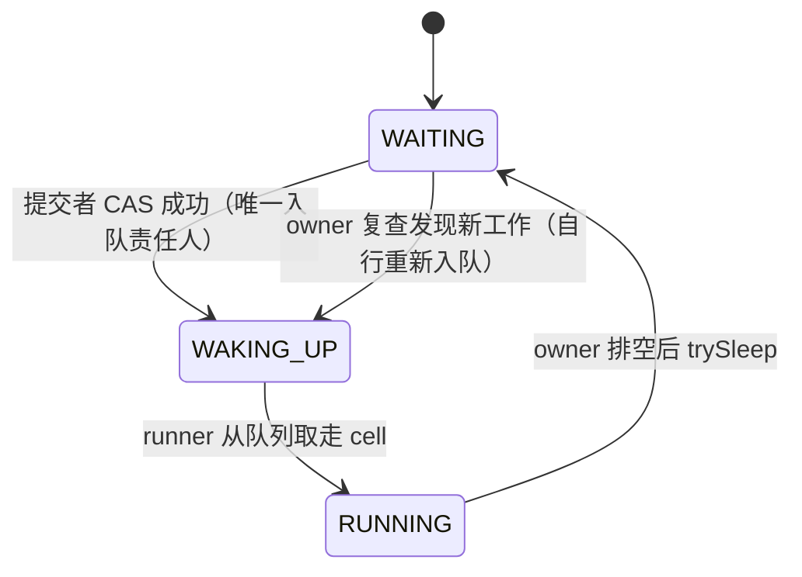
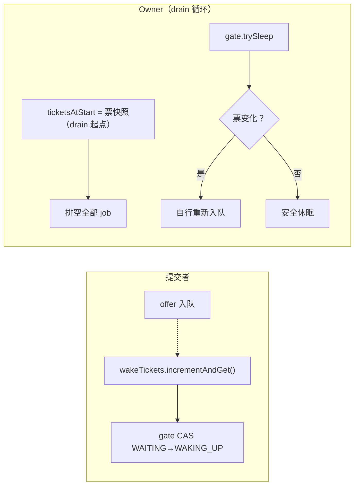
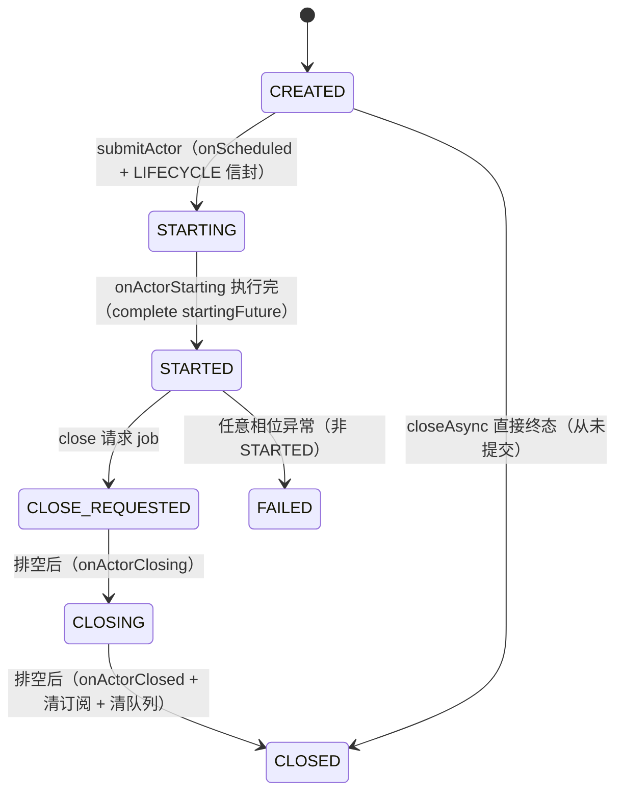

# scheduler 模块设计说明

> 模块：`kunpeng/scheduler`（包 `com.anyilanxin.kunpeng.scheduler`）
> 定位：自研 Actor 模型调度器——单 actor 逻辑串行、work-stealing 负载均衡、虚拟线程载体、毫秒级定时器、阻塞任务外包、内建 Micrometer 指标
> 本文只描述当前设计。历史设计与对比分析见同目录归档文档。

## 1. 能力概览

| 能力 | 说明 |
|------|------|
| 单 actor 串行 | 同一 actor 的 job 任意时刻至多一个线程执行（结构保证，非锁保证） |
| work-stealing | 空闲 runner 从其他 runner 队列物理偷取 cell，actor 可在线程间迁移 |
| 自适应均衡 | cell 无钉扎归属，路由优先 home runner，满则轮转投递 |
| 双载体 | 平台线程池（cpu/io 分池）+ 虚拟线程组（每 cell 一条虚拟线程） |
| 定时器 | DeadlineTimerWheel 时间轮，1ms 精度，跨线程取消安全 |
| 阻塞外包 | runBlocking 把阻塞操作丢 cached pool，完成后回投 actor |
| 生命周期 | 6 相位状态机 + 5 个 protected 钩子 + STARTED 相位容错 |
| 指标 | 13 项内建指标（actor/job/timer/blocking/池深），Doc 单一事实源 |
| 顺序启动链 | StartupProcess：顺序 startup + 逆序 shutdown + 停摆自报告 |

## 2. 公共 API 面（21 类型）

### 2.1 实体与控制

| 类型 | 职责 |
|------|------|
| `Actor` | 逻辑单线程实体基类。子类覆写 `onActorStarting/Started/CloseRequested/Closing/Closed/Failed`、`handleFailure`、`createContext`（惰性调用，可读子类字段）；`Actor.newActor()` 构建裸 actor，`Actor.wrap()` 包装为单钩子 actor |
| `ActorControl` | actor 内部控制面：run/submit/call/schedule/runBlocking/runOnCompletion/条件/关闭。`ActorControl.current()` 取当前执行 actor 的控制面 |
| `ConcurrencyControl` | 控制面接口（Actor 与其他持有者共用语义）：`runOnCompletion`（单/集合）、`run`、`call`、`schedule`、`createFuture` |
| `ActorSchedulingService` | 调度入口：`submitActor(actor[, hints])`、`createActor(...)`、`submitPhase(...)`；返回 startingFuture |
| `ActorScheduler` | 调度器本体 + builder（`setCpuBoundActorThreadCount/setIoBoundActorThreadCount/setSchedulerName/setMeterRegistry` 等），`start()/close()` |
| `SchedulingHints` | 提交提示：`CPU_BOUND`（默认）/`IO_BOUND`/`VIRTUAL_THREAD` |

### 2.2 future 族

| 类型 | 职责 |
|------|------|
| `ActorFuture<V>` | 完成语义接口：complete/completeExceptionally/isDone/isCompletedExceptionally/onComplete(±executor)/andThen×3/thenApply/join/get |
| `CompletableActorFuture<V>` | 默认实现。VarHandle 单次完成状态机；`completed()`/`completedExceptionally()` 工厂；`close()` 后可复用复位 |
| `ActorFutureCollector` | future 集合收集器 |
| `Either<L,R>` | 二选一值容器 |

future 语义要点：

- **非阻塞纪律**：actor 线程内对未完成 future 调 `get()/join()` 抛 `IllegalStateException`——续接必须走 `runOnCompletion`/`onComplete`
- **andThen 三形态**：`Supplier`/`Function` 形态上游出错**快速失败**（不执行 next）；`BiFunction` 形态接收 `(v, e)` 可自行恢复；next 返回 null 视为完成 null
- **thenApply** 非扁平化（返回 U 而非 ActorFuture\<U\>）
- **onComplete 无 executor** 且在 actor 线程：经 `ActorControl.current()` 注册为该 actor 的订阅（回投 actor 上下文执行）；非 actor 线程：直接路径 + WARN
- **集合续接**：`runOnCompletion(空集合)` 立即以 null 回调；非空集合等全部完成后回调（首个异常上抛）

### 2.3 启动链

| 类型 | 职责 |
|------|------|
| `StartupStep<C>` | 步骤接口：`getName()/startup(C)/shutdown(C)` |
| `StartupProcess<C>` | 顺序执行 startup、逆序执行 shutdown；失败聚合 `StartupProcessException`。**每步 INFO 日志**（`Startup <名>` / `Startup step <名> completed` / `Startup process completed`）+ **30s 停摆告警**（`Startup step <名> still running after 30s`）——启动链卡点自报告 |

### 2.4 其余

`ScheduledTimer`（cancel）、`ActorCondition`（signal/cancel）、`ActorClock`（current()）、`AsyncClosable`/`CloseableSilently`、retry 5 策略、exception 4 类、`Loggers`（命名 logger 常量）。

## 3. 核心数据结构

### 3.1 ActorCell（每 actor 一个执行单元）

```
ActorCell
├── fastLane: ArrayDeque<ActorEnvelope>   owner 独占 FIFO（actor 内自提交，立即可见）
├── submitted: ManyToOneConcurrentLinkedQueue   外部 MPSC FIFO，上限 10000 超限 fail
├── subscriptions: ArrayList<SubscriptionSlot>  订阅表（条件/future 完成回调）
├── selfPool: ArrayDeque<ActorEnvelope>    owner 侧信封池（cap 256）
├── gate: SchedulingGate                   三态调度门
├── wakeTickets: AtomicInteger             唤醒票（防丢唤醒）
└── phase: Phases (volatile)               相位机
```

- name/context **延迟委托**给 `actor.getName()/getContext()`（消费期解析；`Actor.getContext()` 惰性调用 `createContext()` 并包 unmodifiable——`createContext` 可安全读取子类字段）
- **早期提交合法**：`submitActor` 之前的 job 照常入队（WARN 提示），首次调度时一并执行；从未提交就被 close 的 actor 在 CREATED 分支逐个 fail 排队 job

### 3.2 ActorEnvelope（池化信封）

一次调用/订阅的载体。Kind：`RUN`（Runnable）/ `CALL`（Callable）/ `LIFECYCLE`（生命周期钩子，不计 job 指标）/ `CLOSE_REQUEST` / `SUBSCRIPTION`（订阅回调）/ `REPEAT`（runUntilDone 循环体）。owner 侧执行后回 selfPool 复用。

### 3.3 载体层

| 结构 | 说明 |
|------|------|
| `RunnerQueue` | 每 runner 一条；MC 添加 / MC 消费；owner 优先 + thief 物理偷取（poll 即得） |
| `StealingRunner` | 平台线程载体（`<name>-cpu-scheduler-N` / `-io-scheduler-N`） |
| `VirtualCarrier` | 虚拟线程载体，每 cell 一条；与平台 runner 共享 drain/finishDrain 骨架 |
| `BlockingRunner` | cached pool（阻塞任务外包） |
| `TimerHub` | 每 runner 一个时间轮封装 |
| `CallbackQueue` | 跨线程回调队列（定时器取消等，路由回 owner runner） |

## 4. 并发协议

### 4.1 三态调度门



gate 只回答"谁负责把 cell 放进调度队列 / 谁在执行"。队列**物理移除**（poll 即得）意味着不存在任务级竞争——单 actor 串行由"同一 cell 在 runner 队列中至多一个实例"结构性保证。

### 4.2 wakeTickets 防丢唤醒

JMM 中存在窗口：提交者 offer 后、CAS gate 见 RUNNING 放弃路由；owner 随后休眠，其复查读不到那个 offer（跨变量可见性无传递性）。用 AtomicInteger 唤醒票封死：



volatile 同步全序保证：提交者的 increment 若发生在 owner trySleep 之前，owner 票复查必看到（不等 → 重新入队）；若发生在之后，提交者 CAS 必见 WAITING → 自行路由。两侧总有一侧负责入队，**丢唤醒协议上不可能**。代价：每次唤醒 +1 volatile 自增（~10-20ns）。

### 4.3 future 完成与回调

- **单次完成**：VarHandle CAS（AWAITING→COMPLETING→终态），二次 complete 抛 IllegalStateException
- **注册/排空互斥**：`completionSync` monitor 封死"回调入队 vs 完成排空已结束"竞态，exactly-once
- **block(cell)**：绑定已完成 future 时**立即 wakeSignal**（否则 cell 永眠）；未完成则注册唤醒回调
- **非 actor 线程阻塞等待**：惰性 ReentrantLock + Condition（多数 future 不被外部等待，零成本）

### 4.4 订阅轮询

索引循环（非迭代器）容忍遍历中增删：订阅动作内可再注册新订阅（如条件回调里 runOnCompletion），新增追加尾部，本轮或下轮消费；cancelled/FutureSlot 消费后即位移除。

## 5. 执行模型

### 5.1 StealingRunner 主循环

```mermaid
flowchart TB
    S["runner 主循环"] --> CB["① 排空跨线程回调队列（定时器取消路由等）"]
    CB --> CK["② clock.update() 跨毫秒？→ 时间轮扫描（到期置 pending + wakeSignal 目标 cell）"]
    CK --> POLL["③ queue.poll() 取 cell"]
    POLL -->|"空"| STEAL["偷取：随机起点遍历其他 runner 队列"]
    STEAL -->|"得"| EX / ..."空"| IDLE["BackoffIdleStrategy（100 spin / 100 yield / park 1ms）"]
    POLL -->|"得"| EX
    EX["④ execute：claimedBy(gate RUNNING) + ThreadLocal 注入 + MDC"] --> DR["drain"]
    DR --> FIN["⑤ finishDrain：trySleep → 票复查 → 必要时自行重入队"]
    FIN --> CB
```

### 5.2 drain 序

`fastLane 优先 → submitted FIFO → pollSubscriptions`，全空后推进相位并 finishDrain。drain 起点 snapshot 唤醒票。

### 5.3 失败分流

job 异常按相位分流：**STARTED 相位 → 存活**（记日志 + fail 该 job future + `handleFailure` 钩子，继续下一 job）；**其他相位 → FAILED 致死**（丢弃剩余、future 异常完成、onActorFailed 钩子）。

## 6. 相位机与关闭语义



- 相位推进发生在排空点（drain 末尾），钩子作为 LIFECYCLE 信封逐级触发
- **close 后 submit → future fail `"Actor is closed"`**；排队中的 job 仍执行完
- `close()` 同步等待最多 300s
- STARTING 期间收到 close → 标记 `closeRequestedBeforeStarted`，STARTED 后补跑

## 7. 定时器

`TimerHub` 封装 Agrona `DeadlineTimerWheel`（1ms/32 ticks，每轮扫描 ≤1000）。schedule 必须在 actor owner 线程（路由到当前 runner 的时间轮）；到期 → pending 标记 + `wakeSignal` 目标 cell → drain 期订阅消费。**跨线程 cancel** 经 `CallbackQueue` 路由回 owner runner，避免时间轮并发访问。recurring 定时器支持周期自续。

## 8. 阻塞任务外包

`runBlocking(runnable, completion)`：job 提交到 `BlockingRunner`（cached pool）执行，完成后经外部提交路径回投 actor 消费 completion。适用于 IO/锁等待等不可避免的阻塞，避免 runner 被占死。

## 9. 线程与上下文

| 机制 | 说明 |
|------|------|
| `CarrierContext` | runner ThreadLocal：绑定 `ActorClock` + 当前执行 cell 的 control；drain 前 set、finally 清除 |
| `ActorClock.current()` | 当前 runner 的共享时钟（跨毫秒判定驱动时间轮） |
| `ActorControl.current()` | 当前正在执行的 actor 的控制面（onComplete 无 executor 路径依赖它回投） |
| MDC | drain 前 注入 cell context（actor.getContext() 惰性解析），结束清除 |
| 非阻塞纪律 | actor 线程 get()/join() 未完成 future → IllegalStateException |

## 10. 指标体系

`SchedulerMetrics` + `SchedulerMetricsDoc`（紧凑声明式单一事实源，与 cluster/logstreams 同款模式）：

| 组 | 指标（前缀 `scheduler.`） |
|----|------|
| actor | `actor.submitted/started/closed/failed`（counter） |
| job | `job.submitted/executed/rejected`（counter，pool tag：cpu/io/virtual；rejected 另有 reason tag） |
| timer | `timer.scheduled/fired/cancelled`（counter） |
| blocking | `blocking.submitted/completed`（counter） |
| 池深 | `queue.depth`（gauge，pool tag） |

生命周期/关闭信封**不计入** job 指标（只反映用户作业负载）。经 builder `setMeterRegistry` 注入（不设则 noop 近零成本）。Grafana 面板见 `monitor/grafana/kunpeng-overview.json`。

## 11. 使用契约速查

| 契约 | 内容 |
|------|------|
| 提交上限 | 外部队列 10000，超限 future fail + `job.rejected{reason=QUEUE_FULL}` |
| 关闭语义 | close 后 submit → `"Actor is closed"`；排队 job 执行完；close() 最多等 300s |
| 条件 | `ActorCondition.signal()` 计数合并，下轮 poll 消费（多次未消费合并为一轮） |
| 让步 | job 内 `yieldThread()` + `runUntilDone` 循环体重跑 |
| 串行保证 | 同 actor job 全序 FIFO；跨线程提交顺序以入队序为准 |
| actor 线程判定 | 一律 ThreadLocal（`ActorClock.current()` 非空 ⇒ 在 actor 线程） |

## 12. 测试锚点（行为契约的守护）

| 测试 | 锚定 |
|------|------|
| `ContractTortureTest` | storm 拷问：多线程×多 job×竞态 close，零丢失；偷取串行性 |
| `SmokeTest` / lifecycle 族 | 相位机、钩子序、close 语义 |
| `RunOnCompletionEmptyCollectionTest` | 空集合续接立即回调（防 join 挂死） |
| `RunOnCompletionCompletedFutureTest` | 已完成 future 的 block() 即时唤醒（防 cell 永眠） |
| `SubscriptionReentrantTest` | 订阅动作内注册新订阅不 CME |
| `SubmitBeforeScheduledTest` | 早期提交排队 + submitActor 捞起；never-submitted close 释放 future |
| `LazyActorContextTest` | createContext 惰性（子类字段就绪后调用） |
| `StartupChainReproTest` | submitActor×N + thenApply/andThen 链式启动全链完成 |
| `SchedulerMetricsTest` | 13 项指标计数与打标 |

修改调度协议/相位/future 语义时，以上测试为行为契约门禁。
